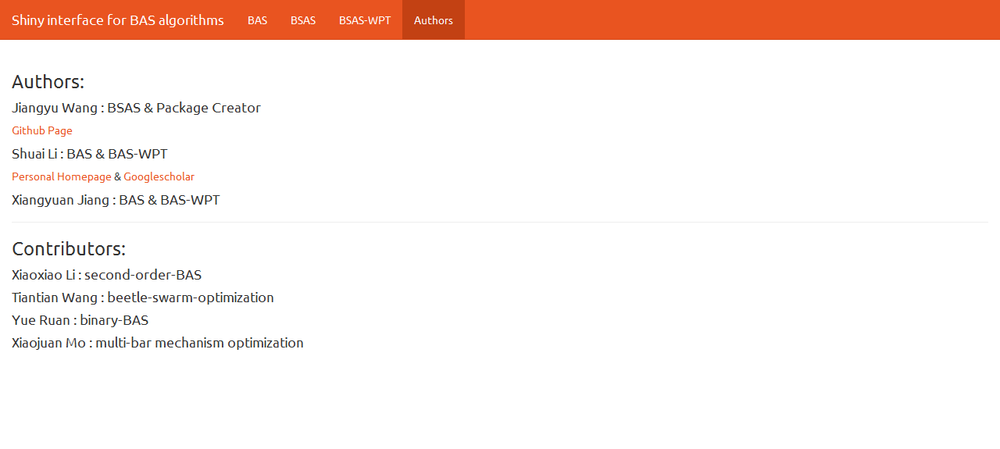

# 作者简介 {#author .unnumbered}

## 作者信息 {-}

- 包作者
    +   王江宇： `BSAS`算法，创建维护`rBAS`包。[Github](https://github.com/jywang2016/rBAS)
    +   李帅： 提出`BAS`以及`BAS-WPT`算法。[个人主页](http://www4.comp.polyu.edu.hk/~cssli/) & [谷歌学术](http://scholar.google.com/citations?hl=zh-CN&user=H8UOWqoAAAAJ)
    +   姜向远： 提出`BAS`以及`BAS-WPT`算法。

- 贡献者
    +   李晓晓： 二阶`BAS`
    +   王甜甜： 天牛群体优化算法`BSO`
    +   阮月： `Binary-BAS`
    +   莫小娟： 多杆机构优化问题

## 用户界面里的作者信息 {-}
在`R`里面输入以下代码：

```{r,eval=FALSE}
rBAS::run_BAS_App(theme = 'united')
#从rBAS包中调用run_BAS_App函数，theme参数是用户界面的主题
```

上面的代码，与下述代码等价：
```{r,eval=FALSE}
library(rBAS) #加载rBAS包，此后调用函数就不需要 rBAS::
run_BAS_App(theme = 'united') #直接调用函数
```

可以看到`rBAS`的用户界面，里面有关于`rBAS`的作者信息。`Rstudio-connect`支持网页上嵌入`shiny`界面的骚操作，有待之后探究，所以用截图\@ref(fig:authors)来展示该作者信息界面。


```{r authors, fig.cap='用户界面作者信息', out.width='80%', fig.align='center', echo=FALSE}

```


