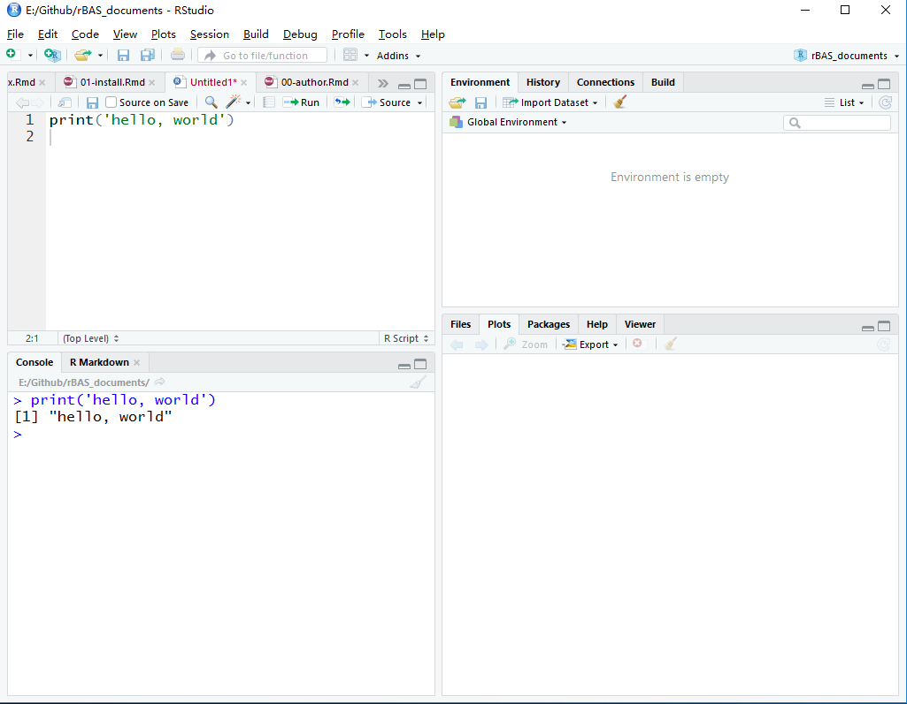

# R以及rBAS安装 {#install}

`R`以及其集成开发环境(IDE)`Rstudio`加起来都不到200M，所以大家放心下载安装，不会是需要10+G的庞然大物。当然，`matlab`也是很好的科学计算软件，这里仅仅是说明安装的大小。

总体来说，R的安装十分简单，类似于把大象装进冰箱只需要三步。

## R安装 {#Rinstall}

`Step1`: 进入R的网站 https://www.r-project.org/ ，然后点击左上角`Download`底下的`CRAN`。

`Step2`: 选择并点击`China`底下的镜像网址，方便下载。然后点击`Download R for windows`，出现的界面右上角有`install R for the first time`，点击即可下载。

`Step3`: 安装，不需要各种复杂的配置，按照给定提示操作即可。

但是，打开R，你会发现是如图\@ref(fig:rface)这样过于`简洁`的界面。

```{r rface, fig.cap='R界面', out.width='80%', fig.align='center', echo=FALSE}
knitr::include_graphics("img/R.png")
```

这并不符合新手的操作和开发习惯。因此，你可能需要一个集成开发环境，最好是有函数、变量的提示，方便浏览代码和结果等等优势的软件。那么，我想你说的应该是 `Rstudio`。

## Rstudio安装 {#Rstudioinstall}

`Step1`: 进入下载页面 https://www.rstudio.com/products/rstudio/download/ 。

`Step2`: 选择`free`版本的下载。

`Step3`: 安装，无需配置特别的环境变量等。

那么，打开`Rstudio`后，会看到如图\@ref(fig:rstudioface)这样的界面。

```{r rstudioface, fig.cap='Rstudio界面', out.width='80%', fig.align='center', echo=FALSE}

```

左上角是撰写代码脚本的区域，左下角是结果输出的窗口。右下角的`files`可以查看工作路径下的文件，和`matlab`左侧的栏目是类似的；`plots`用于查看使用代码绘制的图像，`packages`可以用于安装`CRAN`上发布，或者是本地的`packages`，也就类似`matlab`的`toolbox`；`help`则是用来显示各个函数的帮助文档；`Viewer`则是用来预览`R`生成的交互图像(比如`plotly`绘制的图)，生成的网页(比如我现在正在使用`bookdown`包来写本手册，那就可以预览生成的`gitbook`电子书的内容)等等。右上角的`Environment`显示被加载进来的函数，变量等信息，和`matlab`的`workspace`是类似的。 剩下的和本手册无关，可以在后面的开发中慢慢了解。

## rBAS安装 {#rBASinstall}

在`Rstudio`的`Console`框内输入:
```{r,eval=FALSE}
install.packages('devtools')
```

因为目前`rBAS`包还不在`CRAN`内，所以需要通过`devtools`包，来从`github`上安装。所以我们先在本地安装`devtools`包。如果觉得代码敲的累，那么有个更直观的方式，如图\@ref(fig:devtools)：

```{r devtools, fig.cap='devtools手动安装示意图', out.width='80%', fig.align='center', echo=FALSE}

```

最后，有了`devtools`包，我们可以从`github`上安装`rBAS`包了。

```{r,eval=FALSE}
#不加载devtools，只调用其中的函数
devtools::install_github("jywang2016/rBAS")
```

接下来，我们可以使用`rBAS`的函数了。

