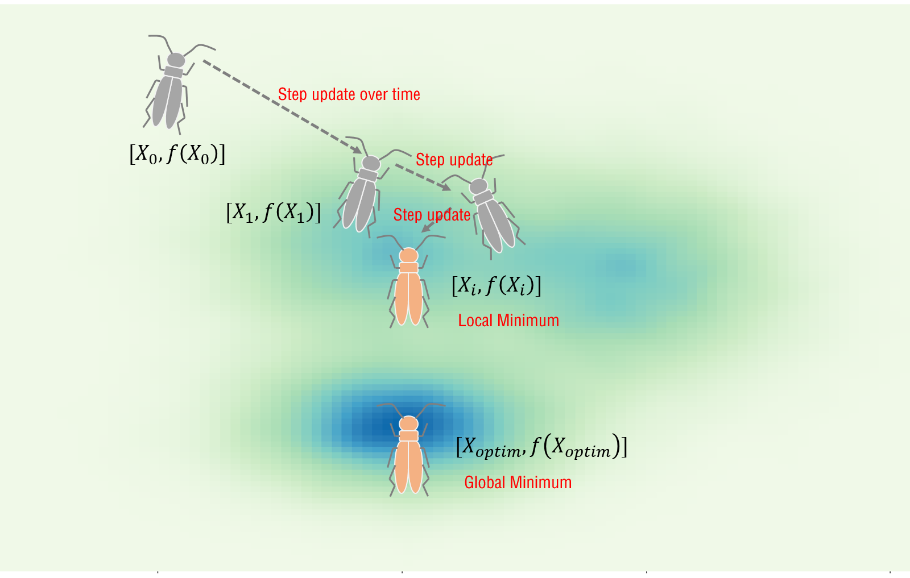
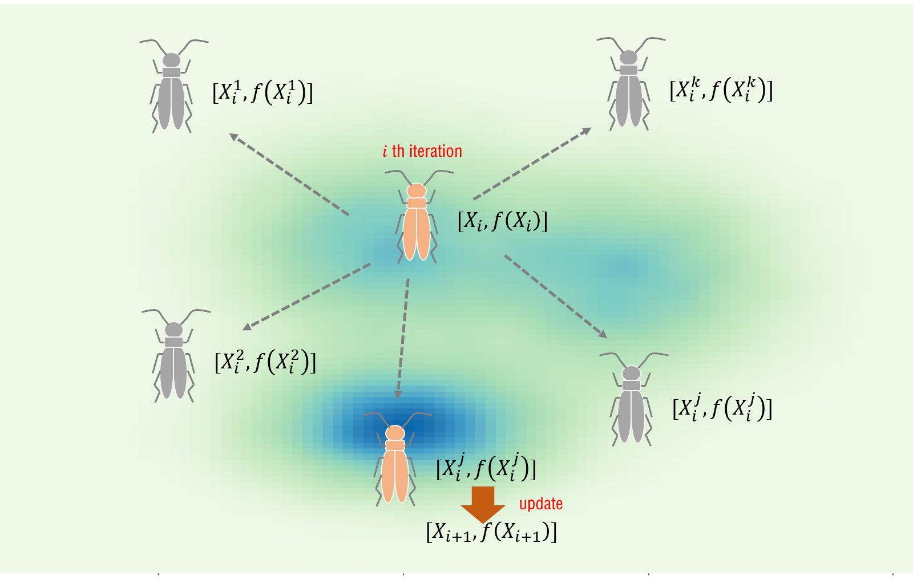

# 算法原理 {#algorithm}

本章讲述目前`rBAS`集成的三种算法的原理。如有错漏，还请指出。

## BAS
关于`BAS`，主要的参考资料为`姜向远`博士和`李帅`老师在`arXiv`上的论文，[BAS: beetle antennae search algorithm for optimization problems](https://arxiv.org/abs/1710.10724)。而我是在知乎上看到一篇[文章](https://zhuanlan.zhihu.com/p/30742461)后，才开始复现`BAS`算法。

### 算法流程 {#BASflow}

1.随机生成方向向量，标准化

\begin{equation}
\overrightarrow{\mathbf{b}}=\frac{\text{rnd}(n,1)}{\|\text{rnd}(n,1)\|}
(\#eq:dir)
\end{equation}

其中，$n$是待优化参数的维度。

2.计算左右须的坐标

\begin{equation}
\begin{split}
\mathbf{x}_r&=\mathbf{x}^t+d^t\overrightarrow{\mathbf{b}} \\
\mathbf{x}_l&=\mathbf{x}^t-d^t\overrightarrow{\mathbf{b}}
\end{split}
(\#eq:xlxr)
\end{equation}

其中，$\mathbf{x}^t$为$t$时刻天牛的位置，$d^t$则是$t$时刻，质心到须的距离。

3.根据两须对应函数值，决定天牛下一时刻移动位置

\begin{equation}
\mathbf{x}^t=\mathbf{x}^{t-1}+\delta^t\overrightarrow{\mathbf{b}}\text{sign}(f(\mathbf{x}_r)-f(\mathbf{x}_l))
(\#eq:xupdate)
\end{equation}

其中，$\delta^t$为t时刻的步长,$f$为待优化目标函数。

4.步长与搜索距离更新


\begin{align}
d^t&= \eta_d d^{t-1}+d_0 (\#eq:dupdate)\\
\delta^t&=\eta_{\delta} \delta^{t-1} (\#eq:deltaupdate)
\end{align}


其中，$d_0$是人为设定的距离的常数，$\eta_d$与$\eta_\delta$分别是搜索距离和步长的更新衰减系数。

为了避免参数过多，姜向远博士在`BAS-WPT`算法中是按照式\@ref(eq:WPTupdate)来更新搜索距离和步长的。其中，$c_2$是人为设定的常数。
\begin{align}
\delta^t&=\eta_{\delta} \delta^{t-1}\\
d^t &= \frac{\delta^t}{c_2}
(\#eq:WPTupdate) 
\end{align}

### 不足与改进 {#BASimprove}

在对`BAS`算法的复现与案例应用中，我个人认为，其可能存在如下的缺点。

- 步长更新策略（反馈）
    + 缺点：无论每一步得到的结果是否变得更优，步长总会衰减；
    + 改进：带有反馈的步长更新，在无法找到更优的位置时，才进行步长的更新；
    + 关键：反馈
- 初始步长选取（参数标准化）
    + 缺点：对于多参数且量纲相差较大的问题，步长 $\delta$ 的初始值并不好选取；
    + 改进：标准化参数后，再进行调节，这也是`BAS-WPT`的技巧所在；
    + 关键：标准化
- 群体寻优
    + 缺点：1只天牛在随机方向上搜索更优的位置，容易迷失；
    + 改进：多只天牛寻优，设定的回合内无法找到更优位置，再考虑步长更新；
    + 关键：群体智能
- 约束处理能力不足
    + 缺点：在约束边界上优化目标突变问题的处理上表现不佳
    + 改进：二阶`BAS`
    + 关键：`暂时没有能力归纳`，有待学习二阶`BAS`

## BSAS

在\@ref(BASimprove)节中提及，`BAS`可能在**步长更新**和**群体寻优**两个方面的策略上有一定的不足。因此，我比较莽撞地改出一个粗糙的算法，那就是所谓的`BSAS`，即`beetle swarm antennae search`。在[`BSAS: Beetle Swarm Antennae Search Algorithm for Optimization Problems`](https://arxiv.org/abs/1807.10470)中，我给出了更为详细的材料。至于具体和`王甜甜`同学的`BSO`，即`beetle swarm optimization`有何不同，我需要进一步研究她的论文材料。

### 与BAS不同之处 {#BSASflow}
此部分没有公式，因为和`BAS`算法核心公式思路是一致的。而图\@ref(fig:basflow)与图\@ref(fig:bsasflow)描述了一种假设的寻优场景，能比较清晰地体现`BSAS`与`BAS`之间的不同。

```{r basflow, fig.cap='BAS寻优过程示意', out.width='80%', fig.align='center', echo=FALSE}

```

```{r bsasflow, fig.cap='BSAS寻优过程示意', out.width='80%', fig.align='center', echo=FALSE}

```

假定，天牛要找到图中**最蓝的点**。图\@ref(fig:basflow) 中，天牛的起点在距离最优点较远处。由于位置更新只与时间有关，也就是每一步，天牛的步长都会缩减（为了可视化效果，天牛的大小我并没有缩放）。如果初始位置距离最优点较远，那在给定的步长缩减情况下，天牛只能在一个**局部最优点**处收敛。而图\@ref(fig:bsasflow)中，每回合天牛会派出$k$只天牛在外试探，如果有更优的点，那么更新天牛位置。这样天牛可以更好地到达**全局最优点**。

### 不足与改进 {#BSASimprove}

虽然解决了步长更新和群体寻优的策略问题，但是还有两点并未解决。

- 初始步长选取（参数标准化）
    + 缺点：对于多参数且量纲相差较大的问题，步长 $\delta$ 的初始值并不好选取；
    + 改进：标准化参数后，再进行调节，这也是`BAS-WPT`的技巧所在；
- 约束处理能力不足
    + 缺点：在约束边界上优化目标突变问题的处理上表现不佳
    + 改进：二阶`BAS`

好的是，在`rBAS 0.1.5`中，我们吸收了`BAS-WPT`中**参数标准化**的想法，加入了`BSAS-WPT`算法，来解决步长调参的问题，并取得了一定的改进效果。

## BAS-WPT

相比于\@ref(BASflow)节中描绘的`BAS`，
[Beetle Antennae Search without Parameter Tuning (BAS-WPT) for Multi-objective Optimization](https://arxiv.org/abs/1711.02395)一文给出了改进后的`BAS`是如何处理**步长调节**和**约束问题抽象**的。

### 与BAS不同之处 {#BASWPTflow}

`BAS-WPT`的小尾巴`without parameter tunning`已经说明了两者之间的区别，即`BAS-WPT`是不需要进行参数调节的。当然，按照我现在的理解，是`BAS-WPT`一方面简化了**每回合搜索距离**(质心到须的距离)的**更新**，不需要再**额外设定与调节**诸如$d_0$，$\eta_d$等参数，用户只需要按照式\@ref(eq:WPTupdate)来设置$c_2$便可；另一方面，参数标准化，让**存在量级差异**的参数之间不必再像`BAS`一样，共享一个你不知道该怎么设定的步长$\delta^t$（步长过大，小的参数可能经常处于在边界的状态；步长过小，大的参数可能搜索范围达不到）。

那么上述两方面的优势归纳起来是什么呢，那就是你可以设置一个在 $1$ 附近 $\delta$ ，然后设定一个衰减率 $\eta_{\delta}$，以及步长与搜索距离之比 $c_2$，那么你的天牛就不会出太大的岔子，并且方便调整调节。也就是说，`WPT`不是让你不用调参，而是减轻了调参的负担。

> "不必就纠结归一化处理，之所以这么处理，仅仅是为了调参方便"
>
> --- 姜向远

果然，偷懒催生了这一技巧的诞生。不过，我还得再次啰嗦一句标准化的好（是不是我没有接触这个领域，所以喜欢大惊小怪……）。我们在之后，压力容器约束问题(**混合整型规划**)中，可以看到，待优化参数存在量级差异时，标准化技巧下的步长会比原始的`BAS`步长设定要更加合理。

### 约束问题抽象形式 {#constrform}

此外，`BAS-WPT`还为`BAS`引入了约束问题处理的手段。不过，这和我做模型预测控制时候看到的抽象方式是相同的。我觉得`BAS`的用户们应该都早已了解，此处就照本宣科。

#### 约束问题一般形式

\begin{equation}
\begin{split}
& \frac{\text{Minimize}}{\text{Maximize}} f(\mathbf{x}) \\
s.t.  & g_j(\mathbf{x})\leq 0, j=1, \cdots, K \\
& x^\text{max}_i \leq x_i \leq x^\text{min}_i, i=1, \cdots N
\end{split}
(\#eq:ConProb)
\end{equation}

$g_j(\mathbf{x})\leq 0$ 和 $x^\text{max}_i \leq x_i \leq x^\text{min}_i$ 表示了参数本身的范围和更为精细具体的不等式约束控制。在`rBAS`包中，我们会有很**直观和简便**的方式，来设置这些约束。

#### 惩罚函数

\begin{equation}
F(\mathbf{x})=f(\mathbf{x})+\lambda\sum_{j=1}^{K}h_j(\mathbf{x})g_j(\mathbf{x})
(\#eq:penalty)
\end{equation}


\begin{equation}
h_j(\mathbf{x}) = \begin{cases} 
1, & g_j(\mathbf{x})>0 \\ 
0, & g_j(\mathbf{x})\leq0
\end{cases}
(\#eq:violation)
\end{equation}

其中，式\@ref(eq:penalty)中的$\lambda$表示约束违背的惩罚因子，选取尽量大的正数。而后的$h_j(\mathbf{x})$为`Heaviside`函数，即不等式约束满足时，该函数为0，反之为1。

### 不足与改进 {#BSASimprove}

- 约束处理能力不足
    + 缺点：在约束边界上优化目标突变问题的处理上表现不佳
    + 改进：二阶`BAS`
    
此处的不足，还需要考虑步长反馈和群体搜索的问题。不过，既然`BSAS`把姜博的`WPT`给窃来了，摇身变为了`BSAS-WPT`，那就不说上述两个问题了。等他日有闲，再去整合`李晓晓`同学的二阶`BAS`。

