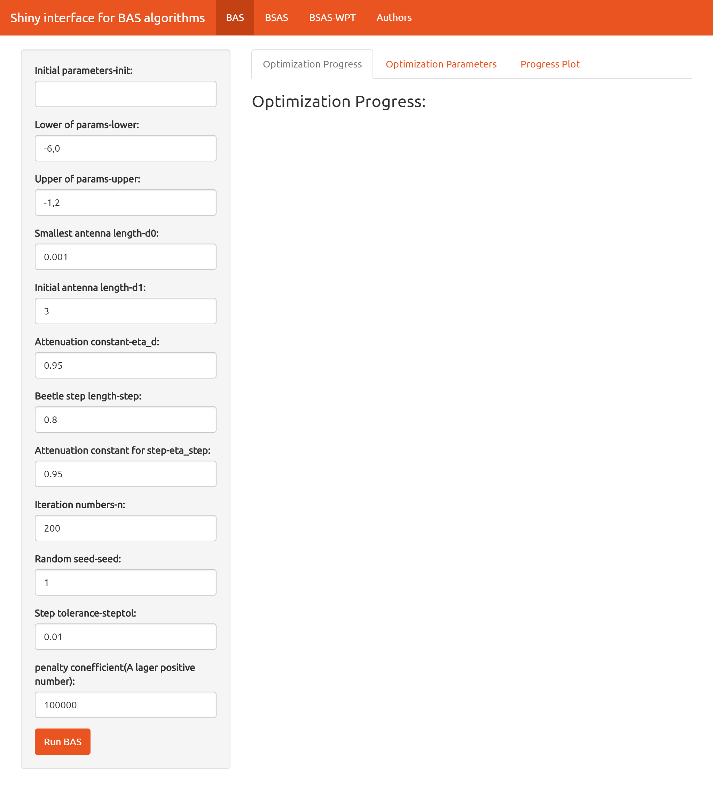
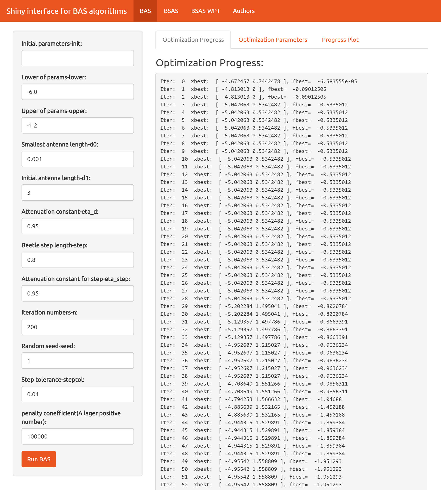
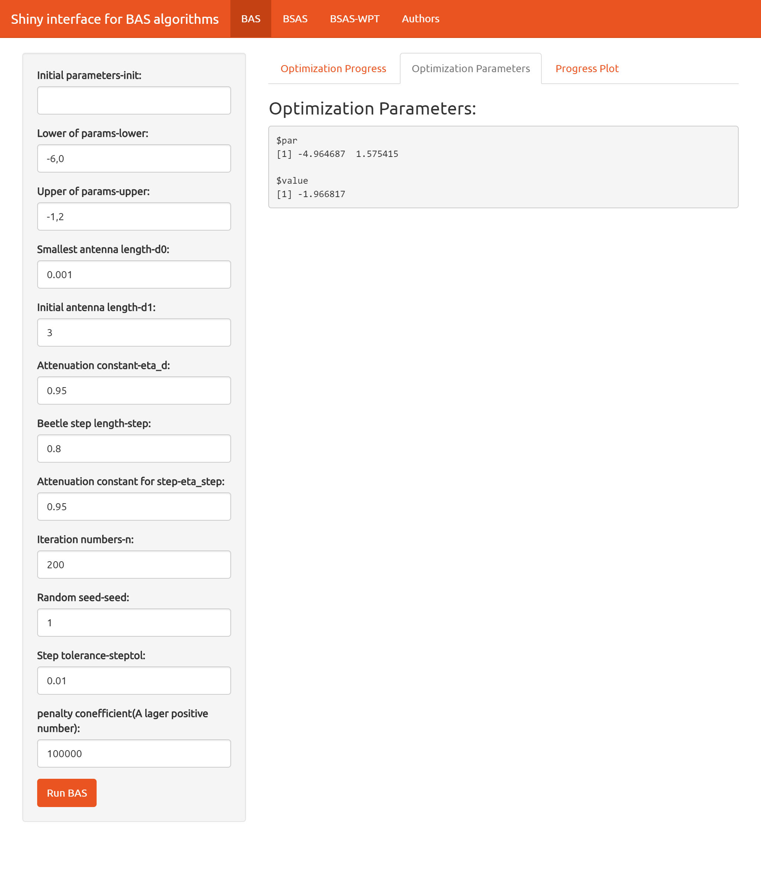
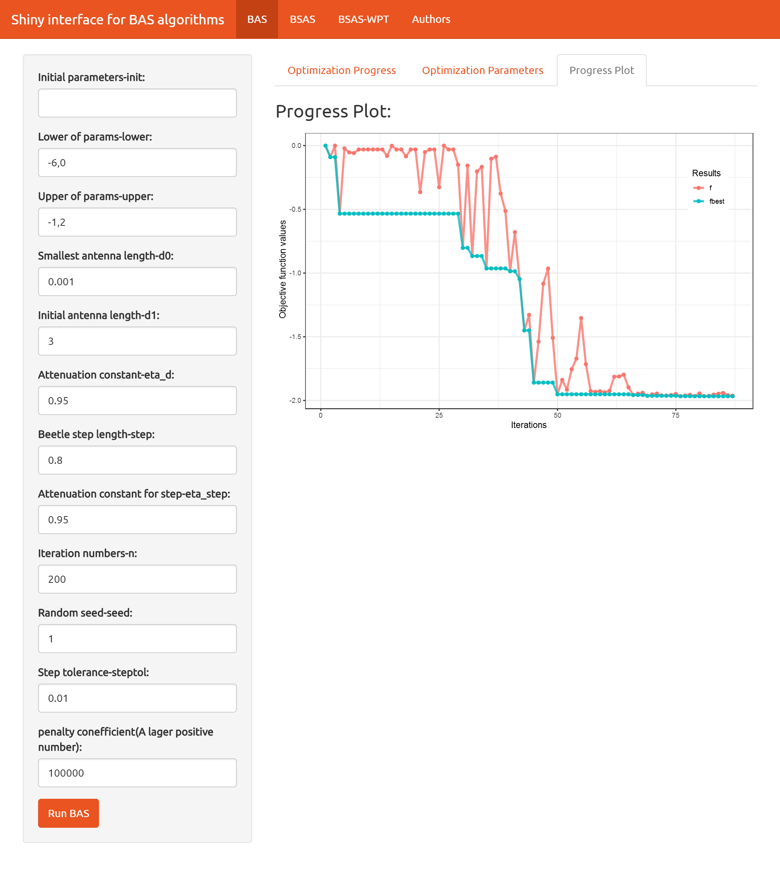
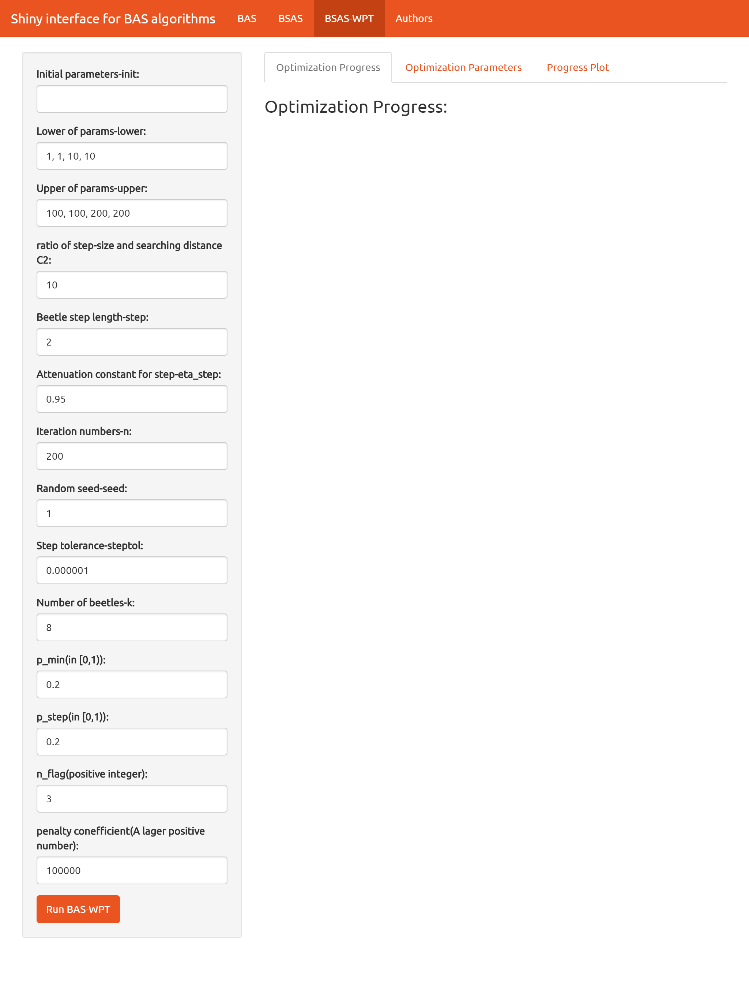
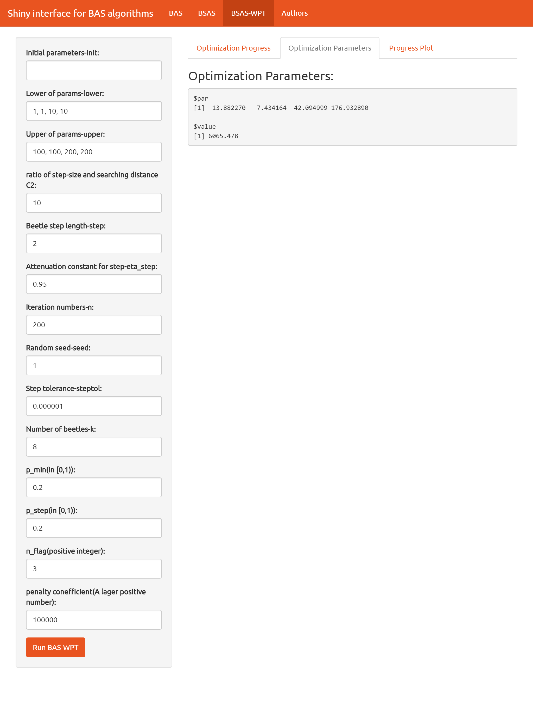
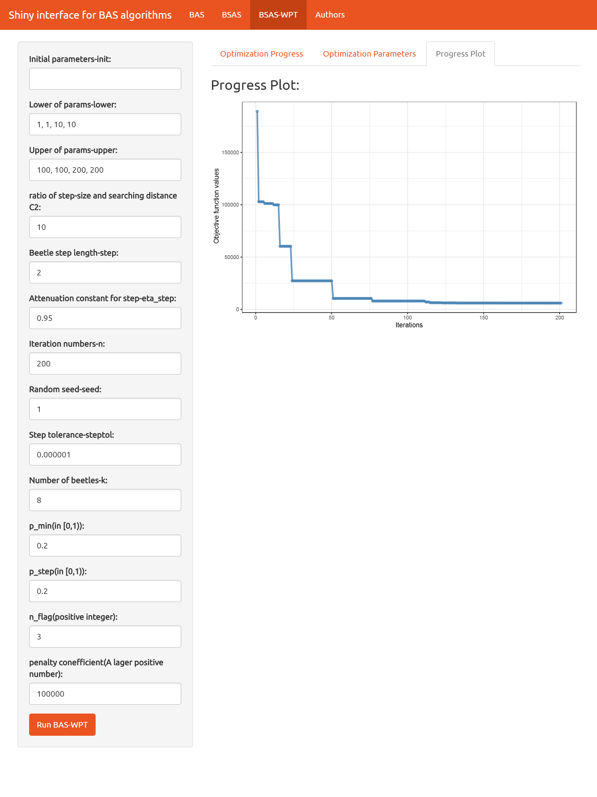

# 用户界面 {#interface}

用户界面基于[shiny](https://github.com/rstudio/shiny)包开发。核心思想是，把目标函数或者约束在`R`的脚本中预先定义好，然后调用`run_BAS_App(func = ..., constr = ...,theme = ...)`函数来人为调节参数，运行以及可视化。

## 调用语句

```{r,eval=FALSE}
run_BAS_App(func = Your-objective-func,
            constr = Your-constraint-func,
            theme = 'united')
```

其中：

- `func`指的是，需要优化的目标函数

- `constr`则是不等式约束，至于上下限约束，可以直接在用户界面里面定义

- `theme`也就是界面主题，即**皮肤**，默认的主题是`united`。可以使用`help(run_BAS_App)`语句来看可选的主题样式都有哪些，如`superhero`,`cosmo`,`paper`,`journal`等主题。这些主题是调用[shinythemes](https://github.com/rstudio/shinythemes)而来。

## 使用案例

### Michalewicz function

先在代码中预定义函数：

```{r,eval=FALSE}
mich <- function(x){
  y1 <- -sin(x[1])*(sin((x[1]^2)/pi))^20
  y2 <- -sin(x[2])*(sin((2*x[2]^2)/pi))^20
  return(y1+y2)
}
```

然后调用用户界面：

```{r,eval=FALSE}
run_BAS_App(func = mich)
#run_BAS_App(func = mich, theme = 'paper') 可以尝试下paper或是其他的主题
```

出现了如图\@ref(fig:basapp)的界面：

```{r basapp, fig.cap='shiny interface', out.width='95%', fig.align='center', echo=FALSE}

```

左边是固定的参数调节栏，最上方有目前的收录的三种算法可供选择，以及本包的作者信息。右侧也有三个选项，分别是**优化过程信息**，**优化参数结果**以及**优化结果可视化**。

按照你的需要，调节好左边的参数信息（第一个参数，也就是初始值`init`，默认为空，也可以指定），然后点击左下方的`Run BAS`键，即可看到如图\@ref(fig:basprogress)的内容：

```{r basprogress, fig.cap='optimization progress栏信息', out.width='95%', fig.align='center', echo=FALSE}

```

> 由于回合数较大，因此只截取了部分内容显示。

分别点击`Optimization Parameters`和`Progress Plot`键，可以看到最后的结果，以及可视化信息，分别如图\@ref(fig:basparms)与 \@ref(fig:basplot)所示。

```{r basparms, fig.cap='Optimization Parameters栏信息', out.width='95%', fig.align='center', echo=FALSE}

```

可以看到，窗口的`$par`显示的是参数的优化结果，而`$value`则是对应的目标函数值。

```{r basplot, fig.cap='Progress Plot栏信息', out.width='95%', fig.align='center', echo=FALSE}

```

`BAS`与其他两种算法有着不同的可视化结果，其并不是基于反馈来控制步长的。因此，图中的两条曲线，红色的为每一回合的目标函数值，而蓝色的为此前回合中最优的目标函数值。

### Pressure Vessel function

这次，我们在`BSAS-WPT`栏下进行界面使用。先在代码中预定义目标函数和约束：

```{r,eval=FALSE}
pressure_Vessel <- list(
  obj = function(x){
    x1 <- floor(x[1])*0.0625
    x2 <- floor(x[2])*0.0625
    x3 <- x[3]
    x4 <- x[4]
    result <- 0.6224*x1*x3*x4 + 
      1.7781*x2*x3^2 +
      3.1611*x1^2*x4 + 
      19.84*x1^2*x3
  },
  con = function(x){
    x1 <- floor(x[1])*0.0625
    x2 <- floor(x[2])*0.0625
    x3 <- x[3]
    x4 <- x[4]
    c(
      0.0193*x3 - x1,#<=0
      0.00954*x3 - x2,
      750.0*1728.0 - pi*x3^2*x4 - 4/3*pi*x3^3
    )
  }
)
```

调用用户界面，注意此时多出了`constr`，也就是约束函数，`$`符号在索引列表中的元素时使用：

```{r,eval=FALSE}
run_BAS_App(func = pressure_Vessel$obj,
            constr = pressure_Vessel$con)
```

自行调整参数后，用户界面如图\@ref(fig:wpt1)所示：

```{r wpt1, fig.cap='BSAS-WPT参数调整', out.width='95%', fig.align='center', echo=FALSE}

```

点击`Run BAS-WPT`之后，选择`optimization Parameters`栏目，可以看到优化结果如图\@ref(fig:wptparms)所示：

```{r wptparms, fig.cap='BSAS-WPT优化结果', out.width='95%', fig.align='center', echo=FALSE}

```

选择`Progress Plot`栏目，过程可视化如图\@ref(fig:wptplot)所示：

```{r wptplot, fig.cap='BSAS-WPT优化过程可视化', out.width='95%', fig.align='center', echo=FALSE}

```

## Authors界面

如果并不想执行任何函数优化，则可以不指定函数和约束。在`R`里面输入以下代码：

```{r,eval=FALSE}
library(rBAS) #加载rBAS包
run_BAS_App() #直接调用函数
```

可以看到`rBAS`的用户界面，里面有关于`rBAS`的作者信息，如图\@ref(fig:author)所示。

```{r author, fig.cap='用户界面作者信息', out.width='100%', fig.align='center', echo=FALSE}
knitr::include_graphics("img/author.png")
```

如果大家对该项目有兴趣，参与了包的开发，或者`BAS`算法应用案例的提出。我会在征得当事人同意的情况下，将名字加入该界面:)。
