# BAS案例一:多杆机构优化问题  {#examples}

说明：由于自身专业知识局限，在整理转述各位研究者或贡献者所提供的材料时，我可能无法准确地表达出对应领域的知识要点。避免言多必失，我仅仅做简要的翻译或者是介绍。对于读者而言，如果觉得并不能解你之疾，或没有**挠到痒处**，建议直接和对应的作者联系。对于贡献者而言，如果我表示有误，欢迎提出建议，或者在github上`pull request`。

> 由群友莫小娟博士研究生提供案例。

由于案例均为各位热心的同学提供，均为自己的研究。因此，希望大家要引用其中的结果时，可以引用对应同学的文章。此外，也请大家转载时注明来源。

## 背景

### 四连杆机构(Four-bar linkage mechanism) {#bars4}

四连杆机构如图\@ref(fig:fourbars)所示：

```{r fourbars, fig.cap='四连杆机构示意', out.width='70%', fig.align='center', echo=FALSE}
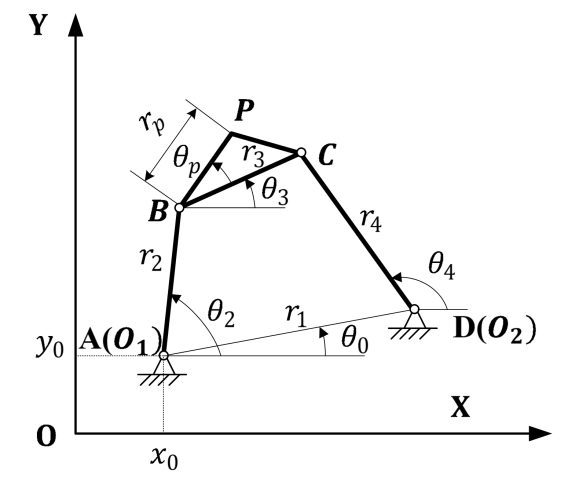
```

基于闭环矢量方程，推导出节点位置。推导过程如式\@ref(eq:bars4loop1)至式\@ref(eq:bars4loop4):

\begin{equation}
\mathbf{\text{Loop:}}   r_1e^{i\theta_0} + r_4e^{i\theta_4} - r_2e^{i\theta_2} -r_3e^{i\theta_3} = 0\\
(\#eq:bars4loop1)
\end{equation}

\begin{equation}
\begin{cases} 
r_1cos(\theta_0) + r_4cos(\theta_4)-r_2cos(\theta_2)-r_3cos(\theta_3)=0 \\ 
r_1sin(\theta_0) + r_4sin(\theta_4)-r_2sin(\theta_2)-r_3sin(\theta_3)=0
\end{cases}
(\#eq:bars4loop2)
\end{equation}

\begin{equation}
\begin{split}
&\theta_3 =2atan(\frac{-A\pm\sqrt{2}{A^2-4BC}}{2B})+\theta_0\\
&A = cos(\theta_2 - \theta_0)-K_1+K_2cos(\theta_2-\theta_0)+K_3\\
&B = -2sin(\theta_2-\theta_0), F=K_1+(K_2-1)cos(\theta_2-\theta_0)+K_3\\
&K_1 = r_1/r_2,K_2=r_1/r_3,K_3=(r_4^2-r_1^2-r_2^2-r_3^2)/(2r_2r_3)\\
\end{split}
(\#eq:bars4loop3)
\end{equation}


\begin{equation}
\begin{cases} 
x_p=x_0+r_2cos(\theta_2)+r_pcos(\theta_3+\theta_p) \\ 
y_p=y_0+r_2sin(\theta_2)+r_psin(\theta_3+\theta_p)
\end{cases}
(\#eq:bars4loop4)
\end{equation}

### 六连杆机构(Stephenson III Six-bar linkage mechanism) {#bars6}

六连杆机构如图\@ref(fig:sixbars)所示：

```{r sixbars, fig.cap='六连杆机构示意', out.width='70%', fig.align='center', echo=FALSE}
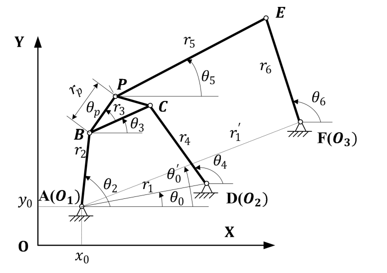
```

基于闭环矢量方程，推导出节点位置和外部链接角度。推导过程如式\@ref(eq:bars6loop1)至式\@ref(eq:bars6loop2):

\begin{equation}
\begin{split}
&\mathbf{\text{Loop1:}}   r_1e^{i\theta_0} + r_4e^{i\theta_4} - r_2e^{i\theta_2} -r_3e^{i\theta_3} = 0\\
&\mathbf{\text{Loop2:}}   r_1'e^{i\theta_0'} + r_6e^{i\theta_6} - r_2e^{i\theta_2} -r_pe^{i(\theta_3+\theta_p)}-r_5e^{i\theta_5} = 0\\
\end{split}
(\#eq:bars6loop1)
\end{equation}

\begin{equation}
\begin{split}
\text{Loop1:}\\
&\alpha = r_2cos(\theta_2) - r_1cos(\theta_0), \beta = r_2sin(\theta_2)-r_1sin(\theta_0) \\
&\gamma = (r_4^2+\alpha^2+\beta^2-r_3^2)/(2r_4),\lambda=atan2(\alpha,\beta)\\
&\theta_4 = atan(cos(\lambda)\gamma/\beta,\{1-(cos(\lambda)\gamma/\beta)^2\}^{1/2})-\lambda\\
&\theta_3=atan2(r_4sin(\theta_4)-\beta,r_4cos(\theta_4)-\alpha)\\
\text{Loop2:}\\
&\alpha_1 = r_2cos(\theta_2)+r_pcos(\theta_3+\theta_p)-r_6cos(\theta_6)\\
&\beta_1=r_2sin(\theta_2)+r_psin(\theta_3+\theta_p)-r_6sin(\theta_6)\\
&\gamma_1=(r_6^2+\alpha_1^2+\beta_1^2-r_5^2)/(2r_6),\lambda_1=atan2(\alpha_1,\beta_1)\\
&\theta_6=atan2(cos(\lambda)\gamma_1/\beta_1,-\{1-(cos(\lambda_1)\gamma_1/\beta_1)^{2}\}^{1/2}) - \lambda_1\\
&\theta_5 = atan2(r_6sin(\theta_6)-\beta_1,r_6cos(\theta_6)-\alpha_1)
\end{split}
(\#eq:bars6loop2)
\end{equation}

于是，可以得到节点位置如式\@ref(eq:bars6loop3)：

\begin{equation}
\begin{cases} 
x_A = x_0,y_A = y_0 \\
x_D = x_0+r_1cos(\theta_0),y_D = y_0+r_1sin(\theta_0)\\
x_F = x_0+r_1'cos(\theta_0'),x_F = x_0 + r_1'sin(\theta_0')\\
x_p = x_0 + r_2cos(\theta_2) + r_pcos(\theta_3+\theta_p)\\
y_P = y_0 + r_2sin(\theta_2)+r_Psin(\theta_3+\theta_p)\\
\end{cases}
(\#eq:bars6loop3)
\end{equation}


## 优化问题

### 四连杆机构 {#bars4optim}

四杆机构的优化问题可以用式\@ref(eq:optim4bars)表示。

\begin{equation}
\begin{split}
\text{min   } &\sum_{i=1}^N[(P_{Xd}^i-P_X^i)^2+(P_{Yd}^i-P_Y^i)^2]+M_1h_1(x)+M_2h_2(x)\\
\text{where } & x_i\in [l_{min}^i,l_{max}^i] \quad \forall x_i \in X,\\
&X=[r_1,r_2,r_3,r_4,r_p,\theta_p,\theta_0,x_0,y_0,\theta_2^1,\cdots,\theta_2^N]\\
\end{split}
(\#eq:optim4bars)
\end{equation}

其中，

\begin{equation}
h_1(x) = \begin{cases}
1, & \text{the Grashof condition false}\\
0, & \text{the Grashof condition true}
\end{cases}
(\#eq:hx1)
\end{equation}

\begin{equation}
h_2(x) = \begin{cases}
1, & \text{the sequence condition of the crank angle false}\\
0, & \text{the sequence condition of the crank angle true}
\end{cases}
(\#eq:hx2)
\end{equation}

$h_1(X)$ 和 $h_2(X)$ 分别用于评估曲柄存在条件（`Grashof Condition`）以及曲柄角度（顺时针或逆时针）的顺序情况。$M_1$ 和 $M_2$分别是对应的惩罚系数。$X$ 为设计参数。

### 六连杆机构 {#bars6optim}

\begin{equation}
\begin{split}
\text{min   } &\sum_{i=1}^N[(P_{Xd}^i-P_X^i)^2+(P_{Yd}^i-P_Y^i)^2]+\sum_{i=1}^M[(\theta_{6d}^i-\theta_6^i)^2]\\
&+M_1h_1(x)+M_2h_2(x)+M_3h_3(X)\\
\text{where } & x_i\in [l_{min}^i,l_{max}^i] \quad \forall x_i \in X,\\
&X=[r_1,r_2,r_3,r_4,r_5,r_6,r_p,\theta_p,\theta_0,x_0,y_0,\theta_2^1,\cdots,\theta_2^N]\\
\end{split}
(\#eq:optim6bars)
\end{equation}

其中，$h_1(X)$ 与 $h_2(X)$ 同式\@ref(eq:hx1)与\@ref(eq:hx2)， $h_3(X)$如式\@ref(eq:hx3)：

\begin{equation}
h_3(x) = \begin{cases}
1, & \text{non-violation of transmission angle false}\\
0, & \text{non-violation of transmission angle true}
\end{cases}
(\#eq:hx3)
\end{equation}

$h_3(X)$ 所表示的是，是否没有违背传动角（超过20°）的约束。同样地，$M_3$ 为对应的惩罚系数。

## 优化理论

案例所使用的算法是**标准化的群体天牛算法**。有意思的是，此处群体天牛算法，和`rBAS`包的`BSASoptim`的算法极为类似。这也说明，加入群体智能策略，会使得`BAS`对于复杂问题寻优能力增强。

联系在于：此案例使用的群体天牛，是在每回合，对于天牛探索方向数的提升。即，每回合生成多个随机的方向，在这些方向上，派出天牛进行试探。这点和`BSAS`保持一致，可以理解为，**如果天牛不止有一对须，而是有多对，那每回合探索的方向也会有多个**。大致的原理如式\@ref(eq:barsbsas)：

\begin{equation}
\begin{split}
x_{ri} &= x_{t} + d^t\overrightarrow{b_i}, \quad i = 1,\cdots,q\\
x_{li} &= x_{t} - d^t\overrightarrow{b_i}, \\
x_{ti} &= x_{t-1} - \delta^t\overrightarrow{b_i}sign(f(x_{ri})-f(x_{li}))
\end{split}
(\#eq:barsbsas)
\end{equation}

区别在于：并未使用基于结果反馈的步长调节策略。

对于轨迹优化问题，莫小娟同学给出的参数建议是，$d_0 = 0.10,\delta_0=0.05,c_1=0.9998,c_2=0.5,q=40,T_{max}=50000$。部分同学可能看过手册的\@ref(algorithm)节，对于步长$d$和须到质心距离$\delta$的更新，即式\@ref(eq:WPTupdate)中有所提及。此处，参数的含义如式\@ref(eq:barsupdate)所示。部分参数与式\@ref(eq:WPTupdate)类同，也有同名但含义冲突的，大家复现时需要注意这些地方。

\begin{equation}
\begin{split}
d^t &= c_1d^{t-1}\\
\delta^t&=c_2 d^t\\
\end{split}
(\#eq:barsupdate) 
\end{equation}

## 优化结果

此处，莫小娟同学提供了8个案例，并且与其他的经典算法（指多杆机构优化问题中多用的算法）进行了优化效果的对比。

### Case1 无规定时间内轨迹生成(Path generation without prescribed timing)

本案例是四杆机构的路径（6个点）在一条垂直的线上（没有规定时间）。通过式\@ref(eq:optim4bars)计算得到误差。

设计参数为：

$$
X = [r_1,r_2,r_3,r_4,r_p,\theta_p,\theta_0,x_0,y_0,\theta_2^1,\cdots,\theta_2^6]
$$
目标点坐标：

$$
\{C_d^i\} = \{(20,20),(20,25),(20,30),(20,40),(20,45)\}
$$

参数约束：

$$
r_1,r_2,r_3,r_4\in[0,60]\quad r_p,x_0,y_0\in[-60,60]\quad \theta_0,\theta_1,\cdots,\theta_2^6,\theta_p\in[0,2\pi]
$$
算法参数为 $d_0 = 0.10,\delta_0=0.05,c_1=0.9998,c_2=0.5,q=40,T_{max}=50000$，动画结果如图\@ref(fig:case1gif)。

```{r case1gif,fig.cap='四杆机构轨迹生成',echo=FALSE,fig.align='center'}
if (knitr:::is_latex_output()) {
  knitr::asis_output('\\url{img/case1.gif}')
} else {
  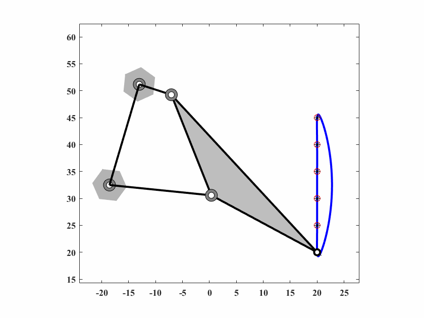
}
```

与其他算法对比结果如图\@ref(fig:case1png)和表\@ref(tab:case1table)。

```{r case1png, fig.cap='各算法优化轨迹', out.width='50%', fig.align='center', echo=FALSE}
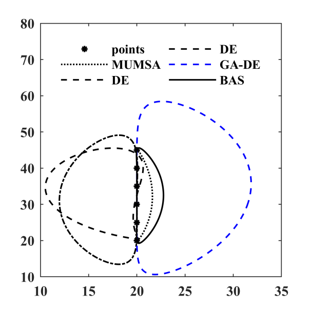
```

```{r case1table, echo=FALSE}
data <- read.table('img/tab/case1.txt')
rownames(data) <- paste0('$',rownames(data),"$")
knitr::kable(
  data, booktabs = TRUE,
  caption = 'case1各算法结果对比'
)
```

### Case2 有规定时间的轨迹生成(with prescribed timing)

本案例四杆机构的路径为5个没有对齐的点（规定时间）。通过式\@ref(eq:optim4bars)计算得到误差。

设计参数为：

$$
X = [r_1,r_2,r_3,r_4,r_p,\theta_p]
$$
目标点坐标：

\begin{align}
&\{C_d^i\} = \{(3,3),(2.759,3.363),(2.759,3.363),(1.890,3.862),(1.355,3.943)\} \notag \\
&\{\theta_2^1,\theta_2^2,\theta_2^3,\theta_2^4,\theta_2^5\}=\{\pi/6,\pi/4,\pi/3,5\pi/12,\pi/2\} \notag \\
\end{align}

参数约束：

$$
r_1,r_2,r_3,r_4\in[0,5]\quad r_p\in[-5,5]\quad \theta_p\in[0,2\pi]
$$

算法参数为 $d_0 = 0.10,\delta_0=0.05,c_1=0.9998,c_2=0.5,q=40,T_{max}=10000$，动画结果如图\@ref(fig:case2gif)。

```{r case2gif,fig.cap='case2四杆机构轨迹生成',echo=FALSE,fig.align='center'}
if (knitr:::is_latex_output()) {
  knitr::asis_output('\\url{img/case2.gif}')
} else {
  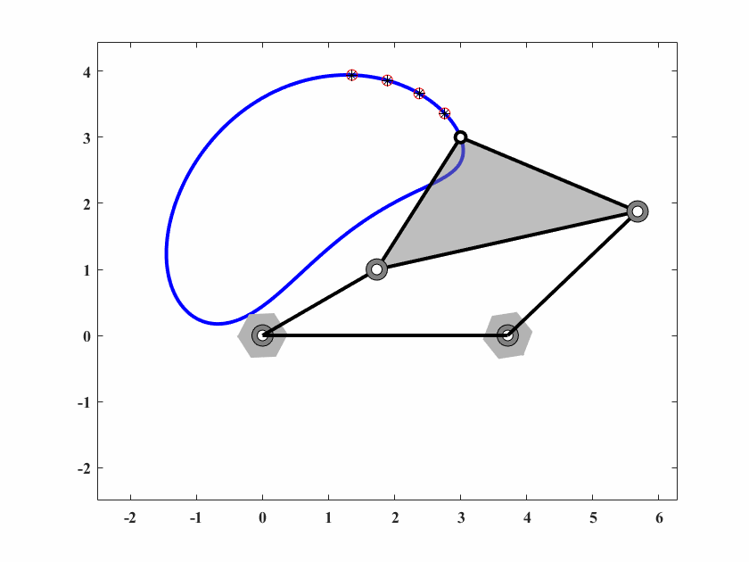
}
```

与其他算法对比结果如图\@ref(fig:case2png)和表\@ref(tab:case2table)。
```{r case2png, fig.cap='各算法优化轨迹', out.width='50%', fig.align='center', echo=FALSE}
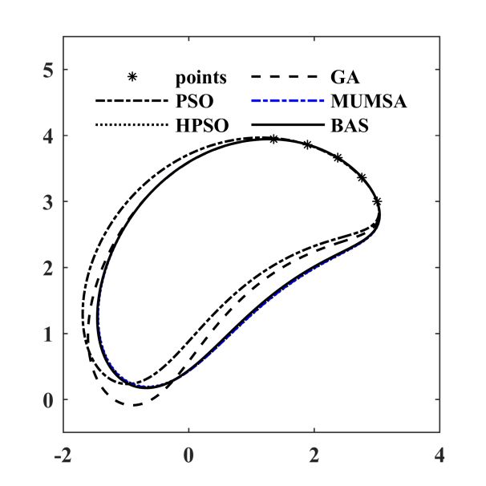
```

```{r case2table, echo=FALSE}
data <- read.table('img/tab/case2.txt')
rownames(data) <- paste0('$',rownames(data),"$")
knitr::kable(
  data, booktabs = TRUE,
  caption = 'case2各算法结果对比'
)
```

### Case3 规定时间内路径生成（Path generation with prescribed timing）

本案例四杆机构需要在规定时间通过一个闭环。通过式\@ref(eq:optim4bars)计算得到误差。

设计参数为：

$$
X = [r_1,r_2,r_3,r_4,r_p,\theta_p,\theta_0,x_0,y_0,\theta_2^1,\cdots,\theta_2^6]
$$

目标点坐标：

\begin{align}
\{C_d^i\} = \{&(0.5,1.1),(0.4,1.1),(0.3,1.1),(0.2,1.0),(0.1,0.9),(0.05,0.75), \notag \\
&(0.02,0.6),(0,0.5),(0,0.4),(0.03,0.3),(0.1,0.25),(0.15,0.2), \notag\\
&(0.2,0.3),(0.3,0.4),(0.4,0.5),(0.5,0.7),(0.6,0.9),(0.6,1.0)\} \notag\\
\{\theta_2^i\}=\{&\theta_2^1,\theta_2^1+20\cdot i/\pi\},\quad i = 1,\cdots,17 \notag \\
\end{align}

参数约束：

$$
r_1,r_2,r_3,r_4\in[0,5]\quad r_p,x_0,y_0\in[-5,5]\quad \theta_0,\theta_2^1,\theta_p\in[0,2\pi]
$$

算法参数为 $d_0 = 0.10,\delta_0=0.05,c_1=0.9998,c_2=0.5,q=8,T_{max}=50000$，动画结果如图\@ref(fig:case3gif)。

```{r case3gif,fig.cap='case3四杆机构轨迹生成',echo=FALSE,fig.align='center'}
if (knitr:::is_latex_output()) {
  knitr::asis_output('\\url{img/case3.gif}')
} else {
  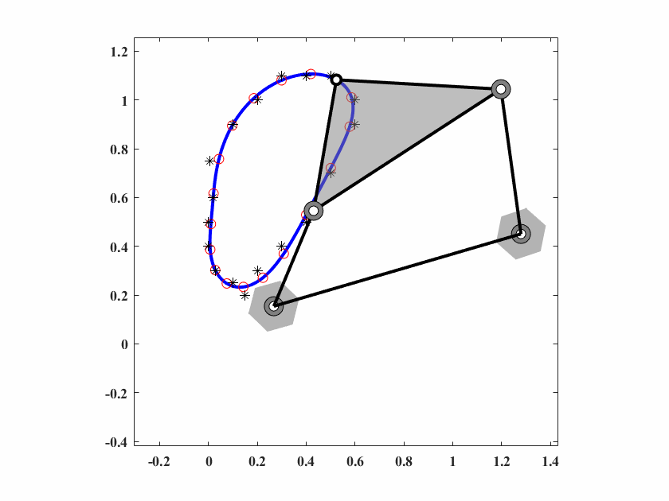
}
```

与其他算法对比结果如图\@ref(fig:case3png)和表\@ref(tab:case3table)。
```{r case3png, fig.cap='各算法优化轨迹', out.width='50%', fig.align='center', echo=FALSE}
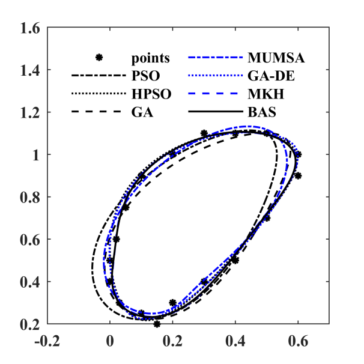
```


```{r case3table, echo=FALSE}
data <- read.table('img/tab/case3.txt')
rownames(data) <- paste0('$',rownames(data),"$")
knitr::kable(
  data, booktabs = TRUE,
  caption = 'case3各算法结果对比'
)
```

### Case4 规定时间路径生成问题

第四个案例同样是一个规定时间的路径生成问题。六个优化点由一个`semi-archer`弧构成，问题定义如下。

设计参数为：

$$
X = [r_1,r_2,r_3,r_4,r_p,\theta_p,\theta_0,x_0,y_0]
$$

目标点坐标：

\begin{align}
&\{C_d^i\} = \{(0,0),(1.9098,5.8779),(6.60989.5106),(13.09,9.5106),(18.09,5.8779),(20,0)\} \notag \\
&\{\theta_2^1,\theta_2^2,\theta_2^3,\theta_2^4,\theta_2^5\}=\{\pi/6,\pi/3,\pi/2,2\pi/3,5\pi/6,\pi\} \notag \\
\end{align}

参数约束：

$$
r_1,r_2,r_3,r_4\in[0,50]\quad r_p,x_0,y_0\in[-50,50]\quad \theta_0,\theta_p\in[0,2\pi]
$$

算法参数为 $d_0 = 0.10,\delta_0=0.05,c_1=0.9997,c_2=0.5,q=40,T_{max}=30000$，动画结果如图\@ref(fig:case4gif)。

```{r case4gif,fig.cap='case4四杆机构轨迹生成',echo=FALSE,fig.align='center'}
if (knitr:::is_latex_output()) {
  knitr::asis_output('\\url{img/case4.gif}')
} else {
  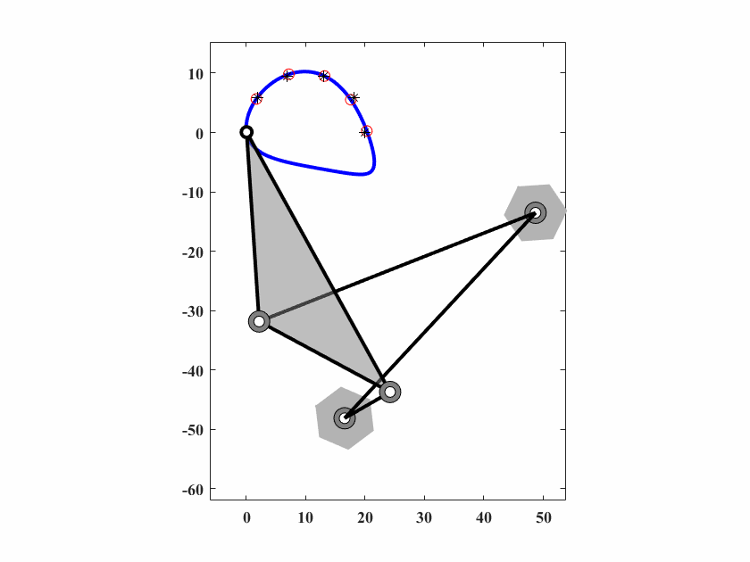
}
```

与其他算法对比结果如图\@ref(fig:case4png)和表\@ref(tab:case4table)。
```{r case4png, fig.cap='各算法优化轨迹', out.width='50%', fig.align='center', echo=FALSE}
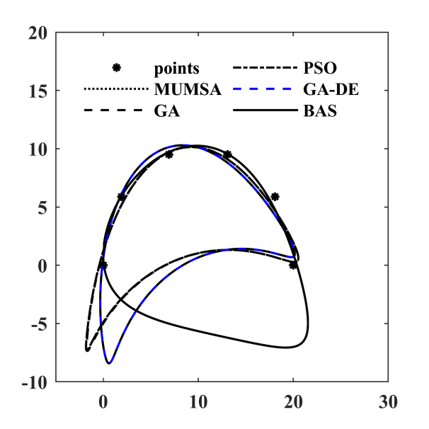
```

```{r case4table, echo=FALSE}
data <- read.table('img/tab/case4.txt')
rownames(data) <- paste0('$',rownames(data),"$")
knitr::kable(
  data, booktabs = TRUE,
  caption = 'case4各算法结果对比'
)
```

### Case5 规定时间内路径生成问题


这个例子是一个椭圆路径生成问题，没有规定的时间，其中轨迹是由10个点定义的。问题定义如下。

设计参数为：

$$
X = [r_1,r_2,r_3,r_4,r_p,\theta_p,\theta_0,x_0,y_0,\theta_2^1,\cdots,\theta_2^{10}]
$$

目标点坐标：

\begin{align}
\{C_d^i\} = \{&(20,10),(17.66,15.142),(11.736,17.878),(5,16.928),(0.60307,12.736), \notag \\
&(0.60307,7.2638),(5,3.0718),(11.736,2.1215),(17.66,4.8577),(20,0)\}\notag\\
\end{align}

参数约束：

$$
r_1,r_2,r_3,r_4\in[0,80]\quad r_p,x_0,y_0\in[-80,80]\quad \theta_0,\theta_2^1,\cdots,\theta_2^{10},\theta_p\in[0,2\pi]
$$

算法参数为 $d_0 = 0.10,\delta_0=0.05,c_1=0.9998,c_2=0.5,q=40,T_{max}=40000$，动画结果如图\@ref(fig:case5gif)。

```{r case5gif,fig.cap='case5四杆机构轨迹生成',echo=FALSE,fig.align='center'}
if (knitr:::is_latex_output()) {
  knitr::asis_output('\\url{img/case5.gif}')
} else {
  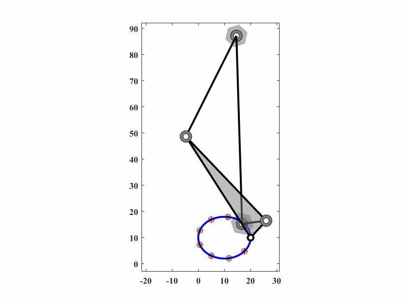
}
```

与其他算法对比结果如图\@ref(fig:case5png)和表\@ref(tab:case5table)。
```{r case5png, fig.cap='各算法优化轨迹', out.width='50%', fig.align='center', echo=FALSE}
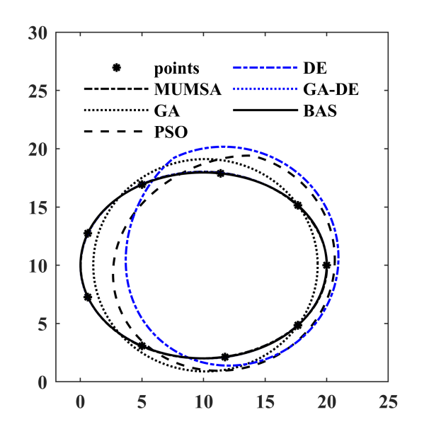
```


```{r case5table, echo=FALSE}
data <- read.table('img/tab/case5.txt')
rownames(data) <- paste0('$',rownames(data),"$")
knitr::kable(
  data, booktabs = TRUE,
  caption = 'case5各算法结果对比'
)
```

### Case6 六杆机构路径生成

这个案例我也看不懂。大概意思是，六杆问题，在规定时间内让轨迹耦合目标点，并且`output link`在停顿位置（`dwell portion`?我翻译不下去了……）保持在一个精确的角度。大家看底下的原文靠谱一点。

>"This case is a path and function combined synthesis problem with prescribed timing in which the coupler of six-bar mechanism has to the precision points and its output link has to maintain an accuracy angle in the dwell portion."
>
> --- Xiaojuan Mo

设计参数为：

$$
X = [r_1,r_2,r_3,r_4,r_5,r_6,r_p,\theta_p,r_1',\theta_0,\theta_0',x_0,y_0,\theta_2^1] 
$$

目标点坐标：

\begin{align}
\{C_d^i\} = \{&(-0.5424,2.3708),(0.2202,2.9871),(0.9761,3.4633), \notag \\
&(1.0618,36380),(0.8835,3.7226),(0.5629,3.7156),\notag \\
&(0.1744,3.6128),(-0.2338,3.4206),(-0.6315,3.1536), \notag \\
&(-1.0,2.8284),(-1.3251,2.4600),(-1.5922,2.0622), \notag \\
&(-1.7844,1.6539),(-1.8872,1.2654),(-1.8942,0.9448), \notag \\
&(-1.8096,0.7665),(-1.6349,0.8522),(-1.1587,1.6081)\} \notag \\
\{\delta_2^i\} = \{&0,15,40,60,80,100,120,140,160,180,\notag \\
& 200, 220,240,260,280,300,320,345\} \notag \\
& \rightarrow \theta_2^i = \theta_2 + \delta_2^i \notag \\
\end{align}

在停顿位置处的输入输出角度的关联如下：

\begin{align}
&\theta_2^i = \theta_2^1+\{160,180,200,220\}\rightarrow \theta_6^i=210 \notag \\
&\theta_2^i=\theta_2^1+\{345,0,15\} \rightarrow \theta_6^i = 225 \notag \\
\end{align}

> 注意，上述涉及到角度的数值单位均为deg，而非弧度。

算法参数为 $d_0 = 0.05,\delta_0=0.025,c_1=0.9999,c_2=0.5,q=10,T_{max}=50000$，动画结果如图\@ref(fig:case6gif)。

```{r case6gif,fig.cap='case6六杆机构轨迹生成',echo=FALSE,fig.align='center'}
if (knitr:::is_latex_output()) {
  knitr::asis_output('\\url{img/case6.gif}')
} else {
  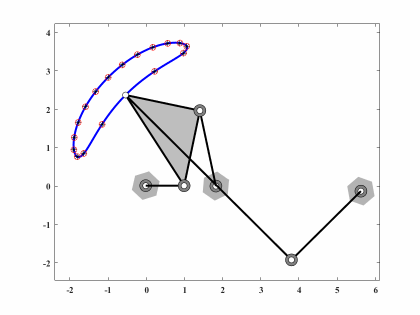
}
```

与其他算法对比结果如图\@ref(fig:case6png), 图\@ref(fig:case6png2)和表\@ref(tab:case6table)。

```{r case6png, fig.cap='各算法优化轨迹', out.width='50%', fig.align='center', echo=FALSE}
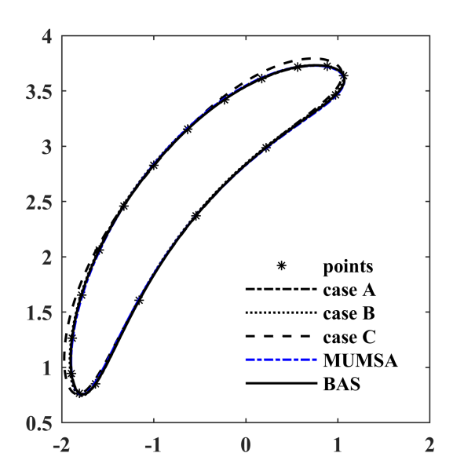
```

```{r case6png2, fig.cap='各算法优化角度', out.width='50%', fig.align='center', echo=FALSE}
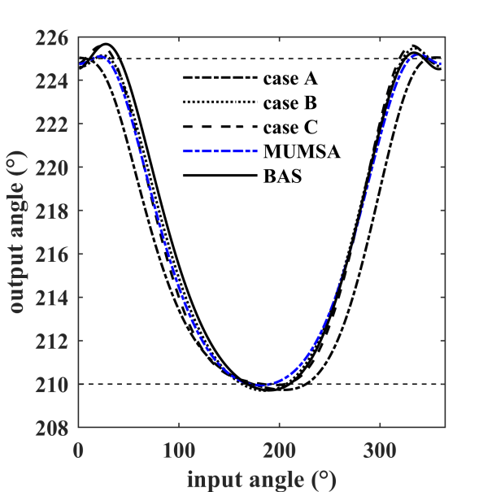
```

```{r case6table, echo=FALSE}
data <- read.table('img/tab/case6.txt')
data[15,] <- format(data[15,],digits =2)
rownames(data) <- paste0('$',rownames(data),"$")
knitr::kable(
  data, booktabs = TRUE,
  caption = 'case6各算法结果对比'
)
```

### Case7 无规定时间的路径生成

本案例为一个'8'型路径生成问题，轨迹由12个点规定。

设计参数为：

$$
X = [r_1,r_2,r_3,r_4,r_p,\theta_p,\theta_0,x_0,y_0,\theta_2^1,\cdots,\theta_2^{12}]
$$

目标点坐标：

\begin{align}
\{C_d^i\} = \{&(4.15,2.21),(4.50,2.18),(4.53,1.83),(4.13,1.68),(3.67,1.58),(2.96,1.33), \notag \\
&(2.67,1.06),(2.63,0.82),(2.92,0.81),(3.23,1.07),(3.49,1.45),(3.76,1.87)\}\notag\\
\end{align}

参数约束：

\begin{align}
&r_1\in[0,5]\quad r_2,r_3,r_4\in[0,10] \quad r_p\in[0,14],\notag \\
&x_0,y_0\in[-80,80]\quad \theta_0,\theta_2^1,\cdots,\theta_2^{12},\theta_p\in[0,2\pi] \notag \\
\end{align}

算法参数为 $d_0 = 0.05,\delta_0=0.025,c_1=0.9995,c_2=0.5,q=40,T_{max}=20000$，动画结果如图\@ref(fig:case7gif)。

```{r case7gif,fig.cap='case7机构轨迹生成',echo=FALSE,fig.align='center'}
if (knitr:::is_latex_output()) {
  knitr::asis_output('\\url{img/case7.gif}')
} else {
  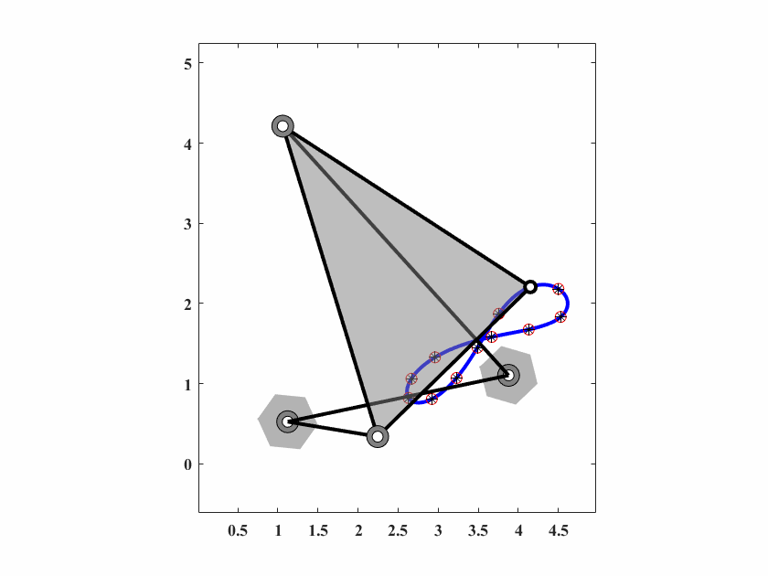
}
```

与其他算法对比结果如图\@ref(fig:case7png)和表\@ref(tab:case7table)。
```{r case7png, fig.cap='各算法优化轨迹', out.width='50%', fig.align='center', echo=FALSE}
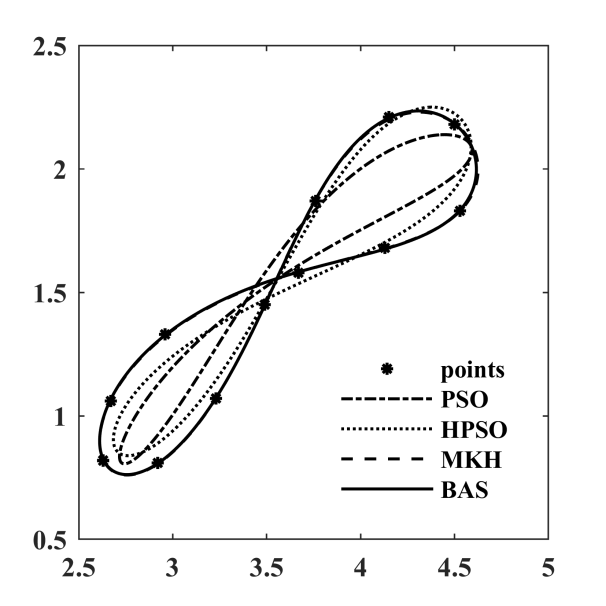
```

```{r case7table, echo=FALSE}
data <- read.table('img/tab/case7.txt')
rownames(data) <- paste0('$',rownames(data),"$")
knitr::kable(
  data, booktabs = TRUE,
  caption = 'case7各算法结果对比'
)
```

### Case8 无规定时间的路径生成

本案例为一个叶形路径生成问题（无规定时间），轨迹由25个点规定。

设计参数为：

$$
X = [r_1,r_2,r_3,r_4,r_p,\theta_p,\theta_0,x_0,y_0,\theta_2^1,\cdots,\theta_2^{25}]
$$

目标点坐标：

\begin{align}
\{C_d^i\} = \{&(7.03,5.99),(6.95,5.45),(6.77,5.03),(6.4,4.6),(5.91,4.03), \notag \\
&(5.43,3.56),(4.93,2.94),(4.67,2.6),(4.38,2.2),(4.04,1.67),\notag \\
&(3.76,1.22),(3.76,1.97),(3.76,2.78),(3.76,3.56),(3.76,4.34), \notag \\
&(3.76,4.91),(3.76,5.47),(3.8,5.98),(4.07,6.4),(4.53,6.75), \notag \\
&(5.07,6.85),(5.05,6.84),(5.89,6.83),(6.41,6.8),(6.92,6.58)\} \notag \\
\end{align}

参数约束：

$$
r_1,r_2,r_3,r_4\in[0,5]\quad r_p,x_0,y_0\in[-5,5] \quad \theta_0,\theta_2^1,\cdots,\theta_2^{25},\theta_p\in[0,2\pi]
$$

算法参数为 $d_0 = 0.05,\delta_0=0.025,c_1=0.99975,c_2=0.5,q=40,T_{max}=50000$，动画结果如图\@ref(fig:case8gif)。

```{r case8gif,fig.cap='case8机构轨迹生成',echo=FALSE,fig.align='center'}
if (knitr:::is_latex_output()) {
  knitr::asis_output('\\url{img/case8.gif}')
} else {
  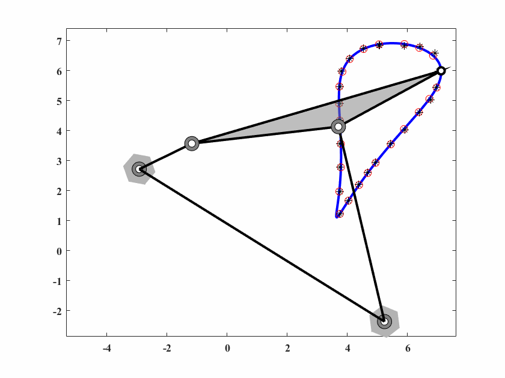
}
```

与其他算法对比结果如图\@ref(fig:case8png)和表\@ref(tab:case8table)。
```{r case8png, fig.cap='各算法优化轨迹', out.width='50%', fig.align='center', echo=FALSE}
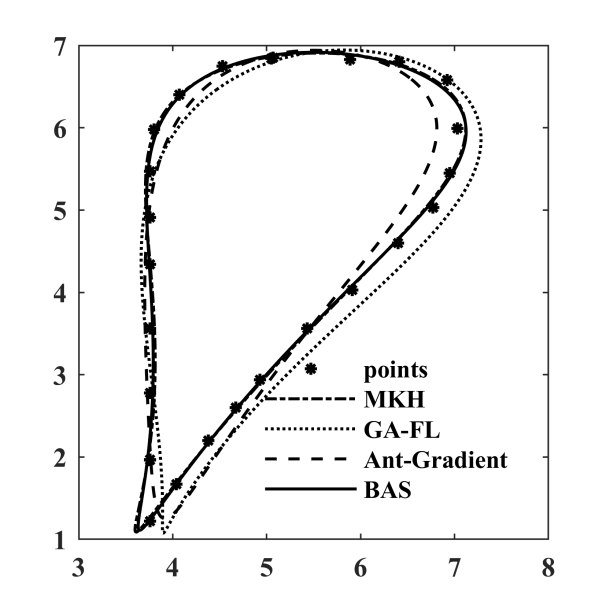
```

```{r case8table, echo=FALSE}
data <- read.table('img/tab/case8.txt')
rownames(data) <- paste0('$',rownames(data),"$")
knitr::kable(
  data, booktabs = TRUE,
  caption = 'case8各算法结果对比'
)
```
