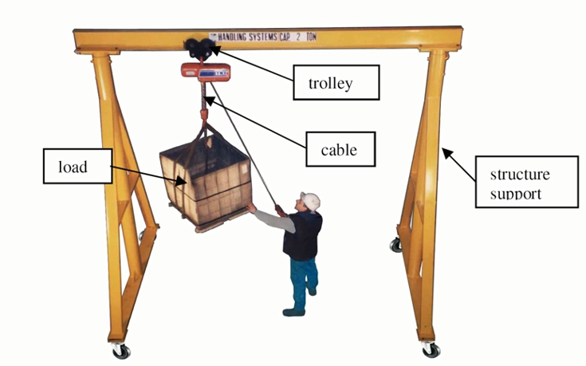
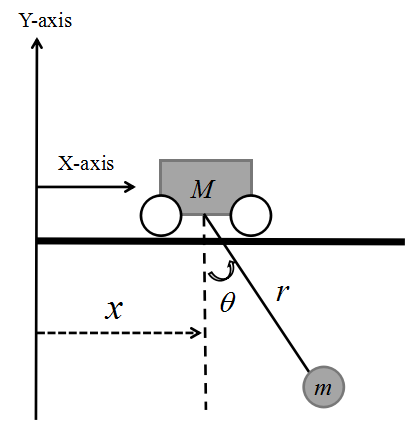
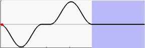
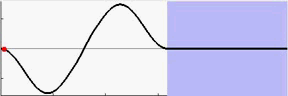
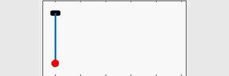
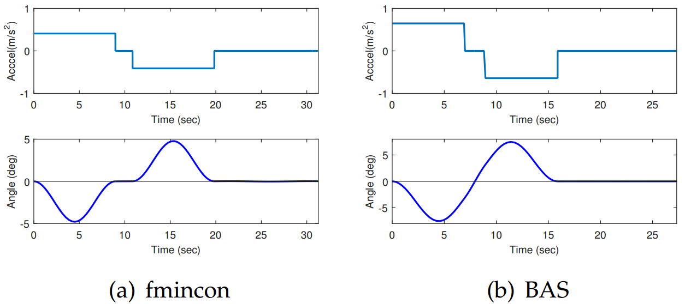
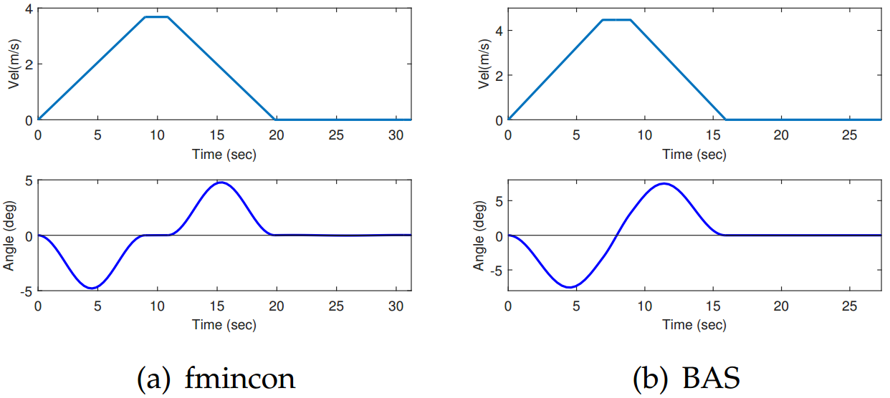
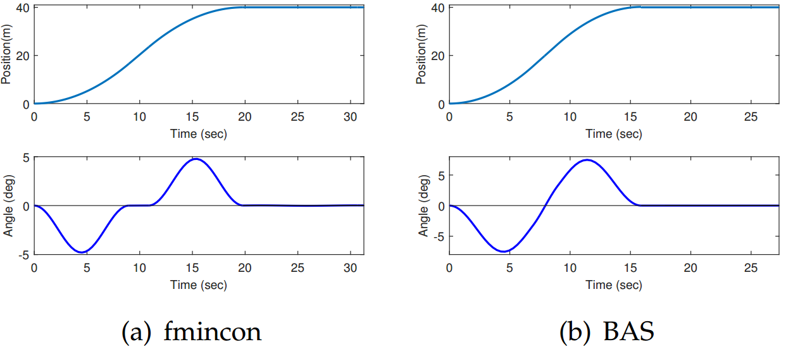

# BAS案例二:龙门起重机运动控制 {#examples2}

> 由群友李晓晓同学提供案例。

## 问题背景

龙门起重机（gantry crane），如图\@ref(fig:gc)所示，是水平桥架设置在两条支腿上构成门架形状的一种桥架型起重机。起重小车trolley在桥架上运行，利用绳索（cable）一类的柔性体连接负载（load）。在负载的输送过程中，load的摆动问题一直是影响吊车装运效率提高的一大难题。

```{r gc, fig.cap='龙门起重机示意', out.width='70%', fig.align='center', echo=FALSE}

```

模型可以简化为图\@ref(fig:gc2)。重物通过绳索与小车相连，小车在外力的作用下水平运动，小车质量为M（kg），重物的质量为m（kg），绳索的长度为r（m），$\theta$为摆角，x表示水平方向上的位移。


```{r gc2, fig.cap='龙门起重机模型', out.width='60%', fig.align='center', echo=FALSE}

```

## 优化问题抽象

优化的变量为`bang-coast-bang`控制中，$x = [tp_1,tp_2,tf]^T$，两个给予脉冲加速度激励的时段以及全部的作业时间，以此来使得负载的摆角（优化目标）最小。

取小车的位置x，摆角$\theta$作为系统的广义坐标系。小车和负载在t时刻的位置坐标如式\@ref(eq:loadposition)所示。

\begin{equation}
\begin{cases} 
x_M(t)&=\quad x(t)\\ 
y_M(t)&=\quad 0 \\
x_m(t)&=\quad x(t)+rsin\theta(t)\\
t_m(t)&=\quad -rco\theta(t)
\end{cases}
(\#eq:loadposition)
\end{equation}

因此，对$t$求导，得到小车和负载的速度分量如式\@ref(eq:speedp)所示。

\begin{equation}
\begin{cases} 
\dot{x}_M(t) &=\quad \dot{x}_t\\
\dot{y}_M(t) &=\quad 0\\
\dot{x}_m(t) &=\quad \dot{x}(t)+r\dot{\theta}(t)cos\theta(t)\\
\dot{y}_m(t) &=\quad r\dot{\theta}(t)sin\theta(t)
\end{cases}
(\#eq:speedp)
\end{equation}

系统动能如式\@ref(eq:kineticenergy)：

\begin{equation}
\begin{split}
T  = &\frac{1}{2}MV_M^2(t) + \frac{1}{2}mV_m^2(t) \\
=&\frac{1}{2}M(\dot{x}_M^2(t)+\dot{y}_M^2(t))+\frac{1}{2}m(\dot{x}_m^2(t)+\dot{y}_m^2(t))\\
=&\frac{1}{2}M\dot{x}_M^2(t) + \frac{1}{2}m\dot{x}_m^2(t) + \\
&\frac{1}{2}mr^2\dot{\theta}^2(t) + mr\dot{x}(t)\dot{\theta}(t)cos\theta(t)
\end{split}
(\#eq:kineticenergy)
\end{equation}

势能如式\@ref(eq:potentialenergy)：

\begin{equation}
P = -mgrcos\theta(t)
(\#eq:potentialenergy)
\end{equation}

通过式\@ref(eq:potentialenergy)和式\@ref(eq:kineticenergy)，我们可以得到拉格朗日方程，即$L = T -P$。根据欧拉-拉格朗日方程(Euler-Lagrangian equation)，龙门起重机的动力学模型如式\@ref(eq:EL)所示。

\begin{equation}
\frac{d}{dt}[\frac{\partial{L}}{\partial{\dot{q_k}}}] - \frac{\partial{L}}{\partial{q_k}}=Q_k, \quad k=1,\cdots,n
(\#eq:EL)
\end{equation}

其中，$n$表示系统的自由度，$\{q_1,\cdots,q_n\}$表示广义坐标集合，$\{Q_1,\cdots,Q_n\}$表示广义的驱动力（对应于各自的广义坐标）。把摆角作为广义坐标，可以得到式\@ref(eq:thetaEL1)。

\begin{equation}
\frac{d}{dt}[\frac{\partial{L}}{\partial{\dot{\theta}}}] - \frac{\partial{L}}{\partial{\theta}}=0
(\#eq:thetaEL1)
\end{equation}

第一项为$mr^2\ddot{\theta}(t)+mr\ddot{x}(t)cos\theta(t)$，第二项为$-mgrsin\theta(t)$，代入式\@ref(eq:thetaEL1)中可以得到$\theta$的求解方程，即式\@ref(eq:thetaEL2)。

\begin{equation}
\ddot{\theta}(t)=-\frac{\ddot{x}(t)cos\theta(t)+gsin\theta(t)}{r}
(\#eq:thetaEL2)
\end{equation}

通过求解该方程，我们可以得到我们的优化目标。

## 优化理论

优化理论为二阶BAS算法。李晓晓同学给出的参数是，$w_0 = 0.7$， $w_1 = 0.2$。当然，文档中对于不同的目标函数可能有不同的调参结果，大家可以自行调试。

## 优化结果

```{r example2parms, echo=FALSE,message=FALSE}
library(dplyr)
data <- data.frame(Parameter = c('c','\\lambda','\\gamma','n','r','h'),
                   Description = c('Constant','Step length ratio',
                                   'Penalty coefficient','Number of iterations',
                                   'Height of crane', 'Load displacement'),
                   Values = c(5,0.95,'$10^{50}$',1000,'20(m)','40(m)'))
data[,1] <- paste0('$',data[,1],"$")

if (knitr:::is_latex_output()) {
  knitr::kable(
  data, booktabs = TRUE,
  caption = '实验参数取值','latex'
) %>%
  kableExtra::kable_styling('striped',full_width = F)
} else {
  knitr::kable(
  data, booktabs = TRUE,
  caption = '实验参数取值','html'
) %>%
  kableExtra::kable_styling('striped',full_width = F)
}
```

```{r example2result, echo=FALSE,message=FALSE}
library(dplyr)
data <- data.frame(Variables = c('tp_1','tp_2','tf','f'),
                   fmincon = c(8.9624,8.9803,19.8346,0.0029586),
                   BAS = c(6.9082,6.9741,15.8866,0.0001415))
data[,1] <- paste0('$',data[,1],"$")

if (knitr:::is_latex_output()) {
  knitr::kable(
  data, booktabs = TRUE,
  caption = '优化结果对比','latex'
) %>%
  kableExtra::kable_styling('striped',full_width = F)
} else {
  knitr::kable(
  data, booktabs = TRUE,
  caption = '优化结果对比','html'
) %>%
  kableExtra::kable_styling('striped',full_width = F)
}
```

从表\@ref(tab:example2result)中可以看到，BAS能够让起重机小车在7秒内加速到最大速度，在16秒内就能到达终点并消除摆角。动图\@ref(fig:example2fminconbob)至\@ref(fig:example2bastrace)分别为采用`fmincon`和`BAS`做优化的结果，可以让我们有更为直观的认识。

```{r example2fminconbob,fig.cap='fmincon摆锤',echo=FALSE,fig.align='center'}
if (knitr:::is_latex_output()) {
  knitr::asis_output('\\url{img/fminconbob.gif}')
} else {
  
}
```


```{r example2basbob,fig.cap='BAS摆锤',echo=FALSE,fig.align='center'}
if (knitr:::is_latex_output()) {
  knitr::asis_output('\\url{img/BASbob.gif}')
} else {
  
}
```

```{r example2fmincontrace,fig.cap='fmincon轨迹',echo=FALSE,fig.align='center'}
if (knitr:::is_latex_output()) {
  knitr::asis_output('\\url{img/fmincontrace.gif}')
} else {
  
}
```


```{r example2bastrace,fig.cap='BAS轨迹',echo=FALSE,fig.align='center'}
if (knitr:::is_latex_output()) {
  knitr::asis_output('\\url{img/BAStrace.gif}')
} else {
  
}
```

```{r ex2accel, fig.cap='起重小车加速度曲线', out.width='70%', fig.align='center', echo=FALSE}

```

```{r ex2velocity, fig.cap='起重小车速度曲线', out.width='70%', fig.align='center', echo=FALSE}

```

```{r ex2position, fig.cap='起重小车位置曲线', out.width='70%', fig.align='center', echo=FALSE}

```
