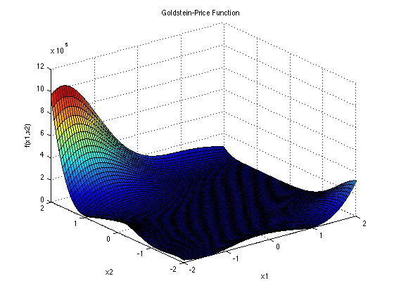
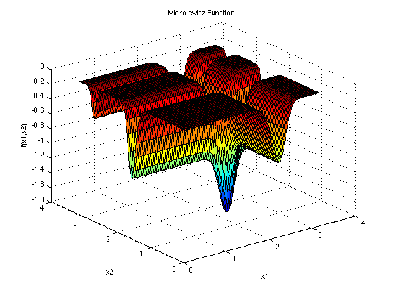

# Python接口 {#python}

项目地址 https://github.com/whhxp/Platypus 。由吴会欢同学fork [Platypus](https://github.com/Project-Platypus/Platypus)项目后，修改而来。

> 文档内容由吴会欢同学提供。

## 安装方式

在线安装

```python
pip install git+https://github.com/whhxp/Platypus.git
```

还可以本地安装。

利用git 将项目克隆到本地，然后目录改为文件目录后，进行安装。

```python
git clone https://github.com/whhxp/Platypus.git
cd Platypus
python setup.py install

```

## 使用

Platypus是一个多目标优化库。这里我们将通过一个例子来简单介绍如何在Platypus中使用BAS。首先我们需要导入需要使用的函数

```python
from platypus import Problem, Real
from platypus.algorithms.bas import BAS
from math import sin, pi, cos, exp, sqrt
```

下一步，我们需要创建问题，这里我找了三个问题作为例子。

第一个问题是Goldstein and Price problem。

```{r python1, fig.cap='Goldstein-Price problem', out.width='70%', fig.align='center', echo=FALSE}

```

\begin{equation}
\begin{split}
f({x})=& [1+(x_1+x_2+1)^2(19-14x_1+3x_1^2-14x_2\notag \\
& +6x_1x_2+3x_2^2)][30+(2x_1-3X_2)^2(18-32x_1\notag  \\
& +12x_1^2+48x_2-36x_1x_2+27x_2^2)]\notag
\end{split}
\end{equation}

这个函数通常在正方形区间 $x_i \in[-2,2]$中进行评估，其中$i = 1,2$. 全局最小值在$x^*=(0,-1)$处，为$f(x^*)=3$。

```python
class gold(Problem):
    def __init__(self):
        super(gold, self).__init__(nvars=2, nobjs=1)
        self.types[:] = [Real(-2, 2), Real(-2, 2)]

    def evaluate(self, solution):
        vars = solution.variables[:]
        x1 = vars[0]
        x2 = vars[1]
        fact1a = (x1 + x2 + 1) ** 2
        fact1b = 19 - 14 * x1 + 3 * x1 ** 2 - 14 * x2 + 6 * x1 * x2 + 3 * x2 ** 2
        fact1 = 1 + fact1a * fact1b

        fact2a = (2 * x1 - 3 * x2) ** 2
        fact2b = 18 - 32 * x1 + 12 * x1 ** 2 + 48 * x2 - 36 * x1 * x2 + 27 * x2 ** 2
        fact2 = 30 + fact2a * fact2b
        solution.objectives[:] = [fact1 * fact2]
```

第一个问题是MICHALEWICZ FUNCTION。

```{r python2, fig.cap='MICHALEWICZ FUNCTION', out.width='70%', fig.align='center', echo=FALSE}

```

$$
f(x)=-\sum_{i=1}^{d}sin(x_i)[sin(\frac{ix_i^2}{\pi})]^{2m}
$$
Michalewicz function 有$d!$个局部极值，通常在$x_i\in[0,\pi],i=1,\cdots,d$内进行评价。

```python
class mich(Problem):
    def __init__(self):
        super(mich, self).__init__(nvars=2, nobjs=1)
        self.types[:] = [Real(-6, -1), Real(0, 2)]

    def evaluate(self, solution):
        vars = solution.variables[:]
        x1 = vars[0]
        x2 = vars[1]
        y1 = -sin(x1) * ((sin((x1 ** 2) / pi)) ** 20)
        y2 = -sin(x2) * ((sin((2 * x2 ** 2) / pi)) ** 20)
        solution.objectives[:] = [y1 + y2]
```
第三个问题是ACKLEY函数（ACKLEY FUNCTION）。

```{r python3, fig.cap='ACKLEY FUNCTION', out.width='70%', fig.align='center', echo=FALSE}
knitr::include_graphics("img/python3.png")
```

$$
f(x) = -aexp(-b\sqrt{\frac{1}{d}\sum_{i=1}^dx_i^2}-exp(\frac{1}{d}\sum_{i=1}^{d}cos(cx_i))+a+exp(1)
$$
推荐的测试参数为$a=20,b=0.2,c=2\pi$, $x_i\in[-32.768,32.768],i=1,\cdots,d$。
全局最小值为$f(x^*)=0,\quad at\quad x^* = (0,\cdots,0)$

```python
class Ackley(Problem):
    def __init__(self):
        super(Ackley, self).__init__(nvars=2, nobjs=1)
        self.types[:] = [Real(-15, 30), Real(-15, 20)]

    def evaluate(self, solution):
        vars = solution.variables[:]
        n = 2
        a = 20
        b = 0.2
        c = 2 * pi
        s1 = 0
        s2 = 0
        for i in range(n):
            s1 = s1 + vars[i] ** 2
            s2 = s2 + cos(c * vars[i])
        y = -a * exp(-b * sqrt(1 / n * s1)) - exp(1 / n * s2) + a + exp(1)
        solution.objectives[:] = [y]
        
```

然后我们将每个问题构成一个单独的实例。

```python
problem = gold()
problem2 = mich()
problem3 = Ackley()
```

接下来，我们创建BAS算法的实例。BAS算法中需要修改一些参数来获得更好的结果。例如第一个BAS实例中step=1,c=5。完成初始化后，我们可以针对不同的问题迭代不同的次数，例如第三个BAS实例中，算法迭代了300次。最后通过print函数读取最优解。可以直接输出solution这个类，他的输出顺序是:

**Solution[solution.variables|solution.objectives|solution.constraints]**

```python
algorithm = BAS(problem, step=1, c=5)
algorithm.run(100)
print(algorithm.best)
```
结果显示为：

```
Solution[-0.0024583254426162517,-1.002363921850713|3.0026888420039026|0]
```
当然也可以直接输出目标函数，例如算法实例2。

```python
algorithm2 = BAS(problem2, step=5)
algorithm2.run(1000)
print(algorithm2.best.objectives)

```
结果显示为：

```
[-1.6524859808670134]
```

或者也可以通过格式化的方法获得更好的输出效果
```python
algorithm3 = BAS(problem3, step=30, c=0.1)
algorithm3.run(300)
print('Variables = {}\nObjective = {}'.format(algorithm3.best.variables,algorithm3.best.objectives))
```
结果显示为:

```
Variables = [1.52121543e-06 2.42423873e-06]
Objective = [8.095169530708546e-06]
```
