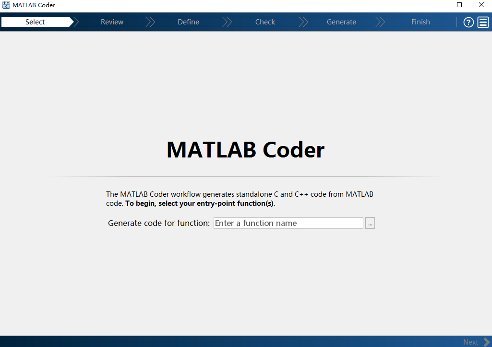
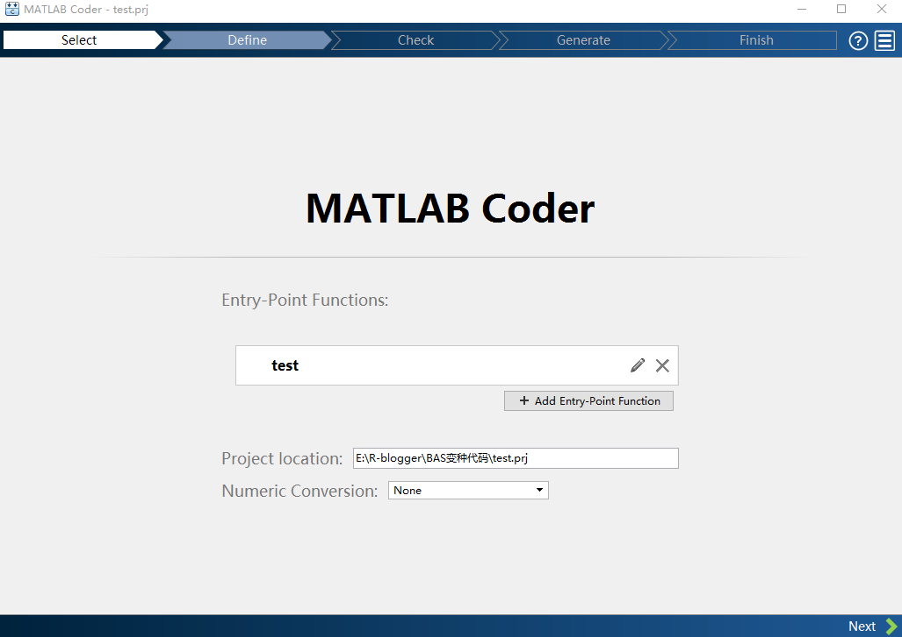
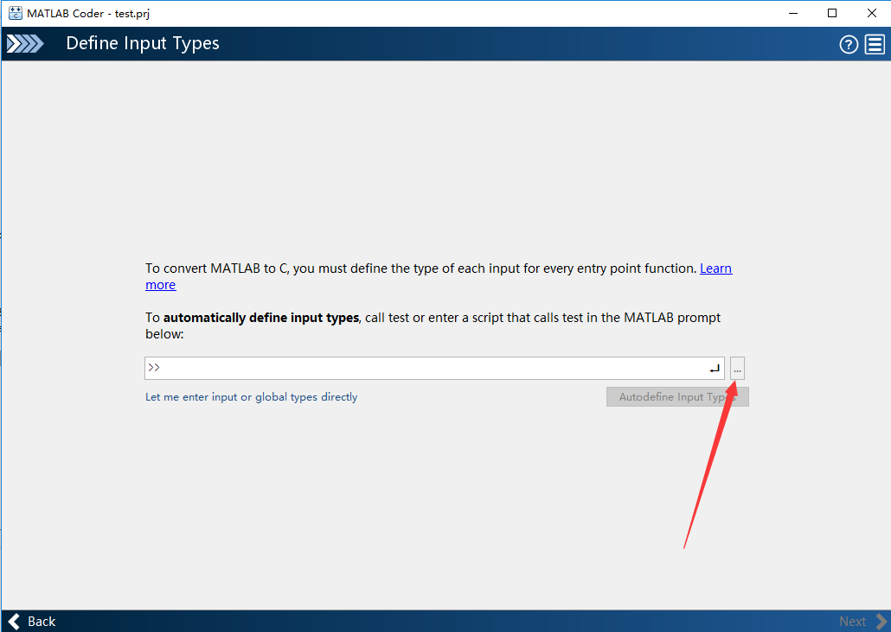
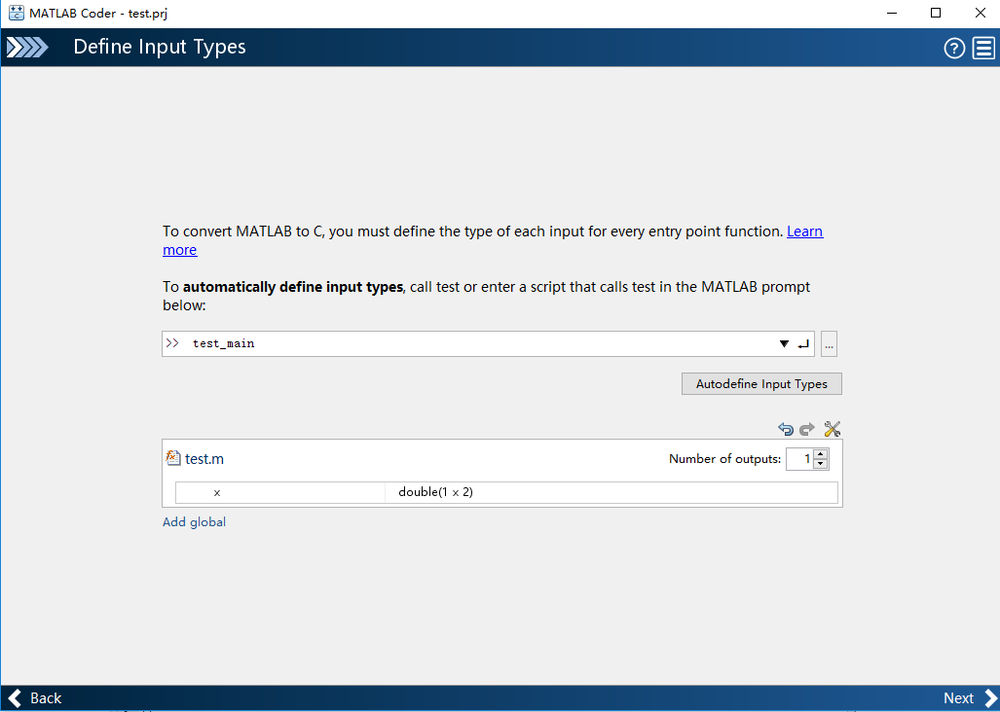
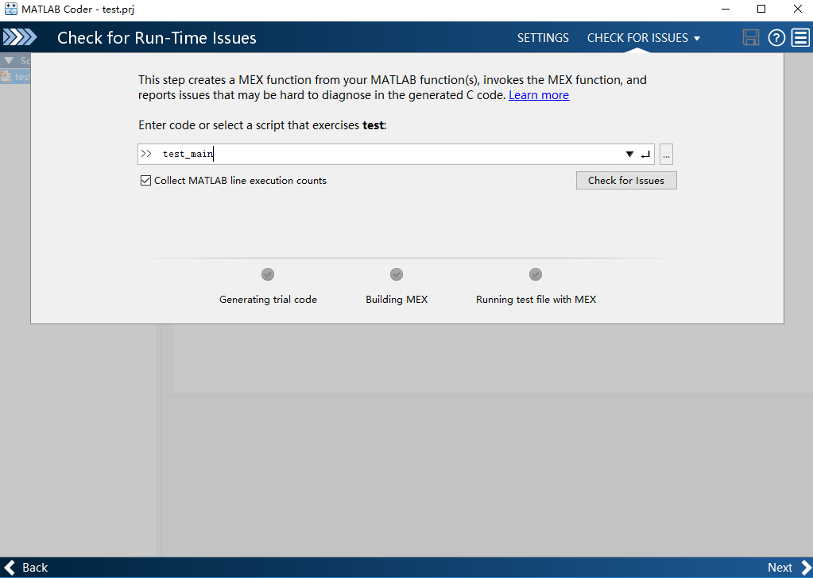
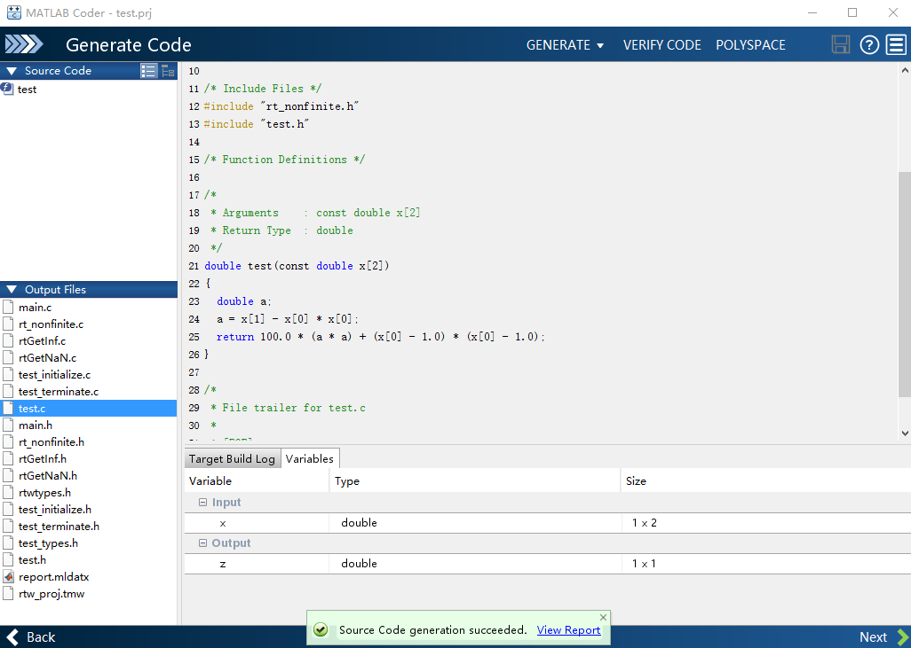

# Matlab用户 {#matlabr}

之前一直有同学在群里面反映，有没有matlab用户可以使用rBAS的方法。尽管我曾经也是matlab的忠实用户，但现在能力退化严重，实在是写不动代码。加之，我认为学习R的成本很低，而且更加便捷。因此，也就熄了再去做一个matlab toolbox的心思。

不过，我还是决定尝试下是否存在两者的接口，可以完成参数的传递，让使用matlab的同学也可以使用rBAS。于是有了下面几点思路。

- 使用matlab，通过R(D)COM服务器来与R通讯，其配置对于R用户而言尚且显得麻烦，何况matlab用户。不过在看mathwork的网站时，倒是得知他们把R interface作为了未来的开发计划之一。所以，日后可以采用在matlab中调用R的形式。目前尚无此功能。
- 使用R中的R.matlab包，来与matlab通讯。这个办法咋一看很简单，尝试也成功了。最大的问题是**慢**，其次看源码应该是要配置**Java**(我电脑上原本有，执行无碍，但没有删除Java后尝试)。这种慢，可以称为很慢，后面我们能见识到。
- 使用**第三方语言**，如C/C++。别害怕，因为matlab提供了很强大的工具，即`Matlab Coder`来把你的matlab代码转为C或者C++。

下面我们讲第二点和第三点是如何操作的。

## 使用R.matlab包

这一节更类似于娱乐和探索。因为该方法用于优化求解的速度，真的让人难以接受（也有可能是我没有找对方法）。如果无意于此，可以跳过。

首先，可以按照下面的代码从CRAN安装该包。

```{r,eval=FALSE}
install.packages('R.matlab')
```

当然，也可以利用`devtools`从github上按照该包。

```{r,eval=FALSE}
devtools::install_github('HenrikBengtsson/R.matlab')
```

接下来，按照[包的文档](https://cran.r-project.org/web/packages/R.matlab/R.matlab.pdf)进行操作。

首先，加载包。

```{r,eval=FALSE}
library('R.matlab')
```

在R中打开`matlab server`。

```{r,eval=FALSE}
Matlab$startServer()
```

效果就是可以看到matlab窗口以最小化的形式出现，不过里面没有视图，大家可以不必理会。后续操作均在R中完成。

其次创建matlab对象，用于与Matlab通讯。

```{r,eval=FALSE}
matlab <- Matlab()
```

然后，把要优化的函数（**使用matlab定义**），写入R。

```{r,eval=FALSE}
setFunction(matlab, " \
  function z=test(x) \
            %test function \
            z = 100 *(x(2) - x(1).^2).^2+(x(1)-1).^2;\
            ")
```

这段代码，在matlab的本地服务器创建了一个M函数，如下所示。注意用`\`号的使用。

``` matlab
function z =test(x,y)
  %test function
  z=100*(y-x.^2).^2+(x-1).^2;

```

接下来我们创建目标函数。

```{r}
func_MR <- function(x){
  setVariable(matlab,x = x) # 把R里面的x，赋值到matlab里面的x变量
  evaluate(matlab,'z = test(x)') # 在matlab里面执行 z = test(x) 命令
  res <- getVariable(matlab,c('z')) # 从matlab里面读取 z 变量
  return(res$z) #返回z值
}
```

这段代码块思路是，既然利用的是rBAS包，那么每次更新，都利用上一回合R计算的值，传递到matlab里面。然后，在matlab里面执行用户定义的函数。最后再用R把matlab里面算出来的变量值读取出来。

这就是我们新的优化函数，虽然绕一点，但是是容易想到和理解的办法。接下来就是使用rBAS包来优化这个目标函数了。

```{r,eval=FALSE}
system.time({
  fit<-
    BSOoptim(fn = func_MR,
             init = NULL,
             s = 2,
             lower = c(-50,-50),
             upper = c(50,50),
             n = 1,
             w = c(0.9,0.4),
             w_vs = 0.4, 
             step = 10,
             step_w = c(0.9,0.4),
             c = 8,
             v = c(-5.12,5.12),
             trace = T,seed = 1)
}) 
```

我们使用了一段`BSO`算法的优化代码，但是，粒子数目设置为2，回合数只设置为1。结果，这么简单的计算，要花费**13s**。两个软件来回通讯占用了大量的时间，我相信，应该不会有用户愿意等待这么长久的时间。这个完整的优化过程，之后会有纯R代码，求解过程不到0.1s的时间。

最后呢，需要使用下面的代码关闭matlab服务器。

```{r,eval=FALSE}
close(matlab)
```

R代码使用`BSO`解这个优化问题是这样的效果。

```{r}
library(rBAS)

test <- function(x){
  z <- 100*(x[2]-x[1]^2)^2 + (x[1] - 1)^2
}

system.time({
  fit<-
    BSOoptim(fn = test,
             init = NULL,
             lower = c(-50,-50),
             upper = c(50,50),
             n = 300,
             w = c(0.9,0.4),
             w_vs = 0.4, 
             step = 10,
             step_w = c(0.9,0.4),
             c = 8,
             v = c(-5.12,5.12),
             trace = F,seed = 1)
})
fit$par
fit$value
```

时间短，而且能求出理论的最小值。这也反映了第二个方法过于低效的问题，我们看看借助第三方语言能否行得通。

## 中转站：C/C++

matlab的`matlab Coder`可以让用户把自己的代码变成C或者C++，前提是，需要有编译器。不过，如果你使用过R，那么一般都会安装[Rtools](https://cran.r-project.org/bin/windows/Rtools/)，这就意味着你安装了MinGw。下面的过程需要用到Rtools，还请大家自行下载安装。

打开matlab，输入下面的指令：

```matlab
mex -steup
```
如果电脑中只安装过Rtools，而没有VS之类的编译器，一般会显示图\@ref(fig:mex)的界面。

```{r mex, fig.cap='mex -setup', out.width='95%', fig.align='center', echo=FALSE}

```

第一句报错，是因为我并没有把Rtools中的mingw_64文件夹加入环境变量。因此，在执行第二句之后，再执行`mex -setup`就不会报错。

好了，加入你成功了，那么抛开前面所有的知识不看。现在说Coder工具箱。

假设你的路径下有2个M文件，一个是我们之前所说的测试函数`test.m`，还有一个是我们所说的，用来测试`test`函数的文件`test_main.m`文件。它们的代码如下。

```matlab
% -------------test.m----------------%

function z = test(x)
z = 100 *(x(2) - x(1).^2).^2+(x(1)-1).^2;

```

```matlab
% -------------test_main.m----------------%

z = test([1 1]);

```

接下来我们点击Matlab菜单栏上的APP，在里面找到Matlab Coder工具箱打开，如图\@ref(fig:coder1)。

```{r coder1, fig.cap='Matlab Coder', out.width='95%', fig.align='center', echo=FALSE}

```

点击Enter a function name右边的 $\cdots$符号，然后选中`test.m`文件，可以看到图\@ref(fig:coder2)的效果。

```{r coder2, fig.cap='Matlab Coder', out.width='95%', fig.align='center', echo=FALSE}

```

点击右下角`Next`按钮，可以看到如图\@ref(fig:coder3)的界面。

```{r coder3, fig.cap='Matlab Coder', out.width='95%', fig.align='center', echo=FALSE}

```

点击图\@ref(fig:coder3)红色箭头所指处，并选中`test_main.m`文件，点击`Autodefine Input types`，可以看到如图\@ref(fig:coder4)的界面，接下来就是一路的`Next`。

```{r coder4, fig.cap='Matlab Coder', out.width='95%', fig.align='center', echo=FALSE}

```

```{r coder5, fig.cap='Matlab Coder', out.width='95%', fig.align='center', echo=FALSE}

```

直到图\@ref(fig:coder6)，点击`Generate`按钮，生成C代码。

```{r coder6, fig.cap='Matlab Coder', out.width='95%', fig.align='center', echo=FALSE}

```

而后工具箱会给出`test.c`代码的预览，如图\@ref(fig:coder7)。

```{r coder7, fig.cap='Matlab Coder', out.width='95%', fig.align='center', echo=FALSE}

```

我相信，大家还是能看懂这段代码。对于简单的优化问题，我们照猫画虎，就可以写出对应的C或者C++的代码。如果不想写，还可以按照上述的方法生成。

那现在问题来了，如果我们有了C代码，如何在R语言中用了。

由于matlab生成的代码很多库都是matlab依赖的（我这么认为，不一定正确），所以我们需要简单地调整一下，把代码变得简洁。

原始的代码是这样的。

```c
/* Include Files */
#include "rt_nonfinite.h"
#include "test.h"

/* Function Definitions */

/*
 * Arguments    : const double x[2]
 * Return Type  : double
 */
double test(const double x[2])
{
  double a;
  a = x[1] - x[0] * x[0];
  return 100.0 * (a * a) + (x[0] - 1.0) * (x[0] - 1.0);
}

/*
 * File trailer for test.c
 *
 * [EOF]
 */

```

我们进行**微调**（大家肯定是能理解并模仿的），变成R可以正确编译的。注意，由于Rcpp能让R和C++无缝贴合的强大功能，我把代码调整为了C++。后面的`Michalewicz function`，`Pressure Vessel function`均是用C++所写。


```rcpp
#include <Rcpp.h>
using namespace Rcpp;
// [[Rcpp::export]]
double test(NumericVector x) {
  double a;
  a = x[1] - x[0] * x[0];
  return 100.0 * (a*a) + (x[0] - 1.0) * (x[0] - 1.0);
}
```

把这段代码保存成`Rcpptest.cpp`文件，然后在R里面执行代码：

```{r,eval=FALSE}
library(Rcpp) #加载Rcpp包
sourceCpp('你的Rcpptest.cpp文件路径') #编译之前保存的cpp文件
```

```{r,include=FALSE}
Rcpp::sourceCpp('E:/R-blogger/C/Rcpptest.cpp')
```

```{r}
#执行BSO优化算法函数
system.time({
  fit<-BSOoptim(fn = test, #调用了编译的C++中的test函数
                init = NULL,
                lower = c(-50,-50),
                upper = c(50,50),
                n = 300,
                w = c(0.9,0.4),
                w_vs = 0.4, 
                step = 10,
                step_w = c(0.9,0.4),
                c = 8,
                v = c(-5.12,5.12),
                trace = F,seed = 1)
})

#查看优化参数
fit$par
#查看优化结果
fit$value
```

执行速度很快，大家可能会有疑问，为啥看起来比纯R代码执行的时间还要长一点。这是因为你多次执行，耗时和电脑所处的状态有关系，这点误差是正常的。但是，如果是计算量较大的代码，利**用Rcpp会比R要节省大量的时间**。

接下来我们看看另外两个例子，也就是`Michalewicz function`和`Pressure Vessel function`函数的优化问题。

`Michalewicz function` 也可以先用matlab生成C或者C++代码，然后稍作改编，保存为`Rcppmich.cpp`文件，代码如下：

```rcpp
#include <Rcpp.h>
using namespace Rcpp;

// [[Rcpp::export]]
double michcpp(NumericVector x) {
  double x0;
  double x1;
  x0 = -sin(x[0])*pow(sin((pow(x[0],2))/M_PI),20);
  x1 = -sin(x[1])*pow(sin((2*pow(x[1],2))/M_PI),20);
  return x0+x1;
}

```

和matlab或者R代码比起来，也是十分易懂的。

```{r,eval=FALSE}
library(Rcpp) #加载Rcpp包
sourceCpp('你的Rcppmich.cpp文件路径') #编译之前保存的cpp文件
```

```{r,include=FALSE}
Rcpp::sourceCpp('E:/R-blogger/C/Rcppmich.cpp')
```

```{r}
#执行BAS优化算法函数
system.time({
  fit<-BASoptim(fn = michcpp, #利用了C++中的michcpp函数
                lower = c(-6,0), upper = c(-1,2),
                seed = 1, n = 100,trace = FALSE)
})

#查看优化参数
fit$par
#查看优化结果
fit$value
```


对于`Pressure Vessel function`，保存为`RcppPV.cpp`文件，代码如下：

```rcpp
#include <Rcpp.h>
using namespace Rcpp;

// [[Rcpp::export]]
double PVobj(NumericVector x) {
  double x0 = floor(x[0])*0.0625;
  double x1 = floor(x[1])*0.0625;
  double x2 = x[2];
  double x3 = x[3];
  
  double result = 0.6224*x0*x2*x3 + 1.7781*x1*pow(x2,2) 
    +3.1611*pow(x0,2)*x3 + 19.84*pow(x0,2)*x2;
  return result;
}

// [[Rcpp::export]]
NumericVector PVcon(NumericVector x) {
  double x0 = floor(x[0])*0.0625;
  double x1 = floor(x[1])*0.0625;
  double x2 = x[2];
  double x3 = x[3];
  
  NumericVector constraint(3);
  constraint[0] = 0.0193*x2 - x0;
  constraint[1] = 0.00954*x2 - x1;
  constraint[2] = 750.0*1728.0 - 3.141593*pow(x2,2)*x3 
    - (4.0/3.0)*3.141593*pow(x2,3);
  return constraint;
}

```

其中，`PVobj`是目标函数，`PVcon`是约束函数。

```{r,eval=FALSE}
library(Rcpp) #加载Rcpp包
sourceCpp('你的RcppPV.cpp文件路径') #编译之前保存的cpp文件
```

```{r,include=FALSE}
Rcpp::sourceCpp('E:/R-blogger/C/RcppPV.cpp')
```

```{r}
#执行BSO优化算法函数
system.time({
  fit<-BSOoptim(fn = PVobj, #C++中的PVobj函数
         init = NULL,
         constr = PVcon, #C++中的PVcon函数
         lower = c( 1, 1, 10, 10),
         upper = c(100, 100, 200, 200),
         n = 1000,
         w = c(0.9,0.4),
         w_vs = 0.9,
         step = 100,
         step_w = c(0.9,0.4),
         c = 35,
         v = c(-5.12,5.12),
         trace = F,seed = 1,
         pen = 1e6)
})

#查看优化参数
fit$par
#查看优化结果
fit$value
```

结果很好，耗时也可以接受。不过，在写`BSOoptim`函数的时候，我使用了2层的循环来嵌套，因此，`BSOoptim`函数比rBAS包中其他的函数要慢上一些。后续我打算使用Rcpp把`BSOoptim`重写一遍，这样对大型的优化问题耗时会更容易接受。

下面是`BSASoptim`对该问题的优化结果，同样也是采用C++编译的方式。

```{r}
system.time({
  result <- BSASoptim(fn = PVobj,
                      k = 5,
                      lower =c( 1, 1, 10, 10),
                      upper = c(100, 100, 200, 200),
                      constr = PVcon,
                      n = 1000,
                      step = 100,
                      d1 = 5,
                      pen = 1e6,
                      steptol = 1e-6,
                      n_flag = 2,
                      seed = 2,trace = FALSE)
})

result$par
result$value
```

